<body class="c68">

GAME DEFINITION DOCUMENT

Responsable de grupo:&nbsp;&nbsp;&nbsp;&nbsp;&nbsp;&nbsp;&nbsp;&nbsp;&nbsp;&nbsp;&nbsp;&nbsp;&nbsp;&nbsp;&nbsp;&nbsp;&nbsp;Gregorio Carvajal Exp&oacute;sito

Antonio Javier Ben&iacute;tez Guijarro

Emilio Chica Jim&eacute;nez

Hugo Maldonado C&oacute;zar

Jose Antonio Martinez Lopez

Javier Labrat Rodriguez 

&Iacute;NDICE

<a class="c18" href="#h.udv8k3shjl57">DEFINICI&Oacute;N GENERAL DEL JUEGO</a>&nbsp;&nbsp;&nbsp;&nbsp;&nbsp;&nbsp;&nbsp;&nbsp;<a class="c18" href="#h.udv8k3shjl57">4</a>

<a class="c18" href="#h.rjpea2p9ab97">OBJETIVO</a>&nbsp;&nbsp;&nbsp;&nbsp;&nbsp;&nbsp;&nbsp;&nbsp;<a class="c18" href="#h.rjpea2p9ab97">4</a>

<a class="c18" href="#h.csn9c1u4xm9u">ESCENARIO</a>&nbsp;&nbsp;&nbsp;&nbsp;&nbsp;&nbsp;&nbsp;&nbsp;<a class="c18" href="#h.csn9c1u4xm9u">4</a>

<a class="c18" href="#h.nbligpj3lsjk">ASPECTOS DEL JUEGO</a>&nbsp;&nbsp;&nbsp;&nbsp;&nbsp;&nbsp;&nbsp;&nbsp;<a class="c18" href="#h.nbligpj3lsjk">4</a>

<a class="c18" href="#h.nui3ilsp0z8t">TIPOS DE TORRETAS</a>&nbsp;&nbsp;&nbsp;&nbsp;&nbsp;&nbsp;&nbsp;&nbsp;<a class="c18" href="#h.nui3ilsp0z8t">4</a>

<a class="c18" href="#h.rf66dr63avyx">TIPOS DE ACCIONES CON LAS TORRETAS</a>&nbsp;&nbsp;&nbsp;&nbsp;&nbsp;&nbsp;&nbsp;&nbsp;<a class="c18" href="#h.rf66dr63avyx">4</a>

<a class="c18" href="#h.6dme45plscms">ASPECTOS DE LAS TORRETAS</a>&nbsp;&nbsp;&nbsp;&nbsp;&nbsp;&nbsp;&nbsp;&nbsp;<a class="c18" href="#h.6dme45plscms">5</a>

<a class="c18" href="#h.9sghjqkzs00">TIPOS DE ENEMIGOS</a>&nbsp;&nbsp;&nbsp;&nbsp;&nbsp;&nbsp;&nbsp;&nbsp;<a class="c18" href="#h.9sghjqkzs00">5</a>

<a class="c18" href="#h.nnwcu5jgsq3q">ASPECTO DE LOS ENEMIGOS</a>&nbsp;&nbsp;&nbsp;&nbsp;&nbsp;&nbsp;&nbsp;&nbsp;<a class="c18" href="#h.nnwcu5jgsq3q">5</a>

<a class="c18" href="#h.yad2oy6ly16">OBJETOS</a>&nbsp;&nbsp;&nbsp;&nbsp;&nbsp;&nbsp;&nbsp;&nbsp;<a class="c18" href="#h.yad2oy6ly16">5</a>

<a class="c18" href="#h.ohs4t46y492e">DIFICULTAD</a>&nbsp;&nbsp;&nbsp;&nbsp;&nbsp;&nbsp;&nbsp;&nbsp;<a class="c18" href="#h.ohs4t46y492e">5</a>

<a class="c18" href="#h.vfxjxwd883dc">LOGROS</a>&nbsp;&nbsp;&nbsp;&nbsp;&nbsp;&nbsp;&nbsp;&nbsp;<a class="c18" href="#h.vfxjxwd883dc">5</a>

<a class="c18" href="#h.67wr7kcolbyi">MEJORAS</a>&nbsp;&nbsp;&nbsp;&nbsp;&nbsp;&nbsp;&nbsp;&nbsp;<a class="c18" href="#h.67wr7kcolbyi">6</a>

<a class="c18" href="#h.ohpwnbwz00r">DEFINICI&Oacute;N DEL HUD</a>&nbsp;&nbsp;&nbsp;&nbsp;&nbsp;&nbsp;&nbsp;&nbsp;<a class="c18" href="#h.ohpwnbwz00r">6</a>

<a class="c18" href="#h.4w129b3zxp4c">DEFINICI&Oacute;N DE BICHOS</a>&nbsp;&nbsp;&nbsp;&nbsp;&nbsp;&nbsp;&nbsp;&nbsp;<a class="c18" href="#h.4w129b3zxp4c">14</a>

<a class="c18" href="#h.qusnt3m56udm">Todos los bichos</a>&nbsp;&nbsp;&nbsp;&nbsp;&nbsp;&nbsp;&nbsp;&nbsp;<a class="c18" href="#h.qusnt3m56udm">14</a>

<a class="c18" href="#h.woaxuq391iha">Bicho bajo</a>&nbsp;&nbsp;&nbsp;&nbsp;&nbsp;&nbsp;&nbsp;&nbsp;<a class="c18" href="#h.woaxuq391iha">14</a>

<a class="c18" href="#h.ysdx69rqm9hh">Bicho medio</a>&nbsp;&nbsp;&nbsp;&nbsp;&nbsp;&nbsp;&nbsp;&nbsp;<a class="c18" href="#h.ysdx69rqm9hh">15</a>

<a class="c18" href="#h.gs0sdv10f7w6">Bicho alto</a>&nbsp;&nbsp;&nbsp;&nbsp;&nbsp;&nbsp;&nbsp;&nbsp;<a class="c18" href="#h.gs0sdv10f7w6">15</a>

<a class="c18" href="#h.60vesdua79at">Super Bicho</a>&nbsp;&nbsp;&nbsp;&nbsp;&nbsp;&nbsp;&nbsp;&nbsp;<a class="c18" href="#h.60vesdua79at">15</a>

<a class="c18" href="#h.gnvsxdpz3jk7">Diagrama de estados</a>&nbsp;&nbsp;&nbsp;&nbsp;&nbsp;&nbsp;&nbsp;&nbsp;<a class="c18" href="#h.gnvsxdpz3jk7">15</a>

<a class="c18" href="#h.r0dtn1cl31ny">DEFINICI&Oacute;N DE TORRES</a>&nbsp;&nbsp;&nbsp;&nbsp;&nbsp;&nbsp;&nbsp;&nbsp;<a class="c18" href="#h.r0dtn1cl31ny">16</a>

<a class="c18" href="#h.luw2d04xamic">Todos las torres</a>&nbsp;&nbsp;&nbsp;&nbsp;&nbsp;&nbsp;&nbsp;&nbsp;<a class="c18" href="#h.luw2d04xamic">16</a>

<a class="c18" href="#h.rlobxiegir8">Torres de ataque</a>&nbsp;&nbsp;&nbsp;&nbsp;&nbsp;&nbsp;&nbsp;&nbsp;<a class="c18" href="#h.rlobxiegir8">16</a>

<a class="c18" href="#h.tr7cg3pe5m31">Torre recolectora:</a>&nbsp;&nbsp;&nbsp;&nbsp;&nbsp;&nbsp;&nbsp;&nbsp;<a class="c18" href="#h.tr7cg3pe5m31">17</a>

<a class="c18" href="#h.115n8cnz5tia">Escudo</a>&nbsp;&nbsp;&nbsp;&nbsp;&nbsp;&nbsp;&nbsp;&nbsp;<a class="c18" href="#h.115n8cnz5tia">17</a>

<a class="c18" href="#h.4m0xxbejpieh">Base</a>&nbsp;&nbsp;&nbsp;&nbsp;&nbsp;&nbsp;&nbsp;&nbsp;<a class="c18" href="#h.4m0xxbejpieh">17</a>

<a class="c18" href="#h.8cyb05k9gyhb">Torreta ametralladora</a>&nbsp;&nbsp;&nbsp;&nbsp;&nbsp;&nbsp;&nbsp;&nbsp;<a class="c18" href="#h.8cyb05k9gyhb">17</a>

<a class="c18" href="#h.pf6non3jtns6">Torreta ca&ntilde;&oacute;n</a>&nbsp;&nbsp;&nbsp;&nbsp;&nbsp;&nbsp;&nbsp;&nbsp;<a class="c18" href="#h.pf6non3jtns6">18</a>

<a class="c18" href="#h.9l7si2gl80g2">Torreta de misiles</a>&nbsp;&nbsp;&nbsp;&nbsp;&nbsp;&nbsp;&nbsp;&nbsp;<a class="c18" href="#h.9l7si2gl80g2">18</a>

<a class="c18" href="#h.7v8mo29j5nhr">Diagrama de estados</a>&nbsp;&nbsp;&nbsp;&nbsp;&nbsp;&nbsp;&nbsp;&nbsp;<a class="c18" href="#h.7v8mo29j5nhr">18</a>

<a class="c18" href="#h.lqlih3tawq0a">DEFINICI&Oacute;N DE MEJORAS</a>&nbsp;&nbsp;&nbsp;&nbsp;&nbsp;&nbsp;&nbsp;&nbsp;<a class="c18" href="#h.lqlih3tawq0a">19</a>

<a class="c18" href="#h.swky9h5hzro5">DEFINICI&Oacute;N DEL MAPA</a>&nbsp;&nbsp;&nbsp;&nbsp;&nbsp;&nbsp;&nbsp;&nbsp;<a class="c18" href="#h.swky9h5hzro5">20</a>

<a class="c18" href="#h.vvi0r3rp4bbc">Todos los mapas</a>&nbsp;&nbsp;&nbsp;&nbsp;&nbsp;&nbsp;&nbsp;&nbsp;<a class="c18" href="#h.vvi0r3rp4bbc">20</a>

<a class="c18" href="#h.c49hqyvvr1bu">Oleada</a>&nbsp;&nbsp;&nbsp;&nbsp;&nbsp;&nbsp;&nbsp;&nbsp;<a class="c18" href="#h.c49hqyvvr1bu">21</a>

<a class="c18" href="#h.bkc7i0ps6oka">DEFINICI&Oacute;N DE LOS NIVELES</a>&nbsp;&nbsp;&nbsp;&nbsp;&nbsp;&nbsp;&nbsp;&nbsp;<a class="c18" href="#h.bkc7i0ps6oka">21</a>

<a class="c18" href="#h.ajy8j286i5jh">Nivel 1</a>&nbsp;&nbsp;&nbsp;&nbsp;&nbsp;&nbsp;&nbsp;&nbsp;<a class="c18" href="#h.ajy8j286i5jh">21</a>

<a class="c18" href="#h.71jcy6wp0rje">Nivel 2</a>&nbsp;&nbsp;&nbsp;&nbsp;&nbsp;&nbsp;&nbsp;&nbsp;<a class="c18" href="#h.71jcy6wp0rje">21</a>

<a class="c18" href="#h.un11n6d3tvuf">Nivel 3</a>&nbsp;&nbsp;&nbsp;&nbsp;&nbsp;&nbsp;&nbsp;&nbsp;<a class="c18" href="#h.un11n6d3tvuf">22</a>

<a class="c18" href="#h.m4gbp1qgd9zc">REGLAS</a>&nbsp;&nbsp;&nbsp;&nbsp;&nbsp;&nbsp;&nbsp;&nbsp;<a class="c18" href="#h.m4gbp1qgd9zc">23</a>

<a class="c18" href="#h.54u0tmjy36ed">TORRES</a>&nbsp;&nbsp;&nbsp;&nbsp;&nbsp;&nbsp;&nbsp;&nbsp;<a class="c18" href="#h.54u0tmjy36ed">23</a>

<a class="c18" href="#h.ph3oa0j2dqbd">BICHOS</a>&nbsp;&nbsp;&nbsp;&nbsp;&nbsp;&nbsp;&nbsp;&nbsp;<a class="c18" href="#h.ph3oa0j2dqbd">25</a>

<a class="c18" href="#h.g9r2790qm8j">OBJETOS ESPECIALES</a>&nbsp;&nbsp;&nbsp;&nbsp;&nbsp;&nbsp;&nbsp;&nbsp;<a class="c18" href="#h.g9r2790qm8j">26</a>

<a class="c18" href="#h.jp8w2e2rf31s">MAPA</a>&nbsp;&nbsp;&nbsp;&nbsp;&nbsp;&nbsp;&nbsp;&nbsp;<a class="c18" href="#h.jp8w2e2rf31s">26</a>

<a class="c18" href="#h.vzejjd5fi3ft">ALGORITMO DE C&Aacute;LCULO DE DA&Ntilde;O</a>&nbsp;&nbsp;&nbsp;&nbsp;&nbsp;&nbsp;&nbsp;&nbsp;<a class="c18" href="#h.vzejjd5fi3ft">27</a>

<a class="c18" href="#h.mk34mkcpd3ja">TABLA DE MAPPINGS</a>&nbsp;&nbsp;&nbsp;&nbsp;&nbsp;&nbsp;&nbsp;&nbsp;<a class="c18" href="#h.mk34mkcpd3ja">28</a>

<h1 class="c34 c22" id="h.udv8k3shjl57">DEFINICI&Oacute;N GENERAL DEL JUEGO</h1><h2 class="c25 c22" id="h.rjpea2p9ab97">OBJETIVO</h2>
El objetivo principal de cada nivel es defender nuestra base de los enemigos colocando torretas defensivas y conseguir sobrevivir a las hordas. 

Como objetivo secundario tenemos que conseguir todos los logros (explicado m&aacute;s abajo) de cada nivel. 

<h2 class="c25 c22" id="h.csn9c1u4xm9u">ESCENARIO</h2><ul class="c14 lst-kix_safbzygyfxg9-0 start"><li class="c11">Un mapa donde se muestran los distintos niveles. S&oacute;lo se muestra por el que vamos y los anteriores (en caso de que haya)</li></ul><ul class="c14 lst-kix_5clbwfryx1bb-0 start"><li class="c11">Un &ldquo;tablero&rdquo; con varios caminos hasta la base. Un entorno con vegetaci&oacute;n alrededor de los mismos que no ser&aacute; accesible, simplemente por decoraci&oacute;n.</li><li class="c11">Las torretas solo se pueden colocar en determinadas zonas. Dichas zonas tienen un aspecto diferente al resto del suelo.</li><li class="c11">Los extractores de recursos solo se pueden colocar en las zonas en las que hallan minas de recursos, que ser&aacute;n claramente identificables en el nivel (parecen piedras azules que brillan)</li></ul>

<h2 class="c25 c22" id="h.nbligpj3lsjk">ASPECTOS DEL JUEGO</h2><ul class="c14 lst-kix_riuan9qnq6nq-0 start"><li class="c11">Si el juego pasa a segundo plano se pausa autom&aacute;ticamente (si la opci&oacute;n del HUD est&aacute; seleccionada).</li><li class="c11">Cuando se completa un nivel, se guarda la partida.</li><li class="c11">Si adelantamos el comienzo de la siguiente oleada haciendo clic en el bot&oacute;n de siguiente oleada, ganaremos m&aacute;s o menos recursos en funci&oacute;n del tiempo restante. Concretamente, ganaremos el doble de recursos que el tiempo restante.</li></ul>

<h2 class="c25 c22" id="h.nui3ilsp0z8t">TIPOS DE TORRETAS</h2><ul class="c14 lst-kix_2z7r4c1t5fbc-0 start"><li class="c11">Base (no posee acciones adicionales ni es posible colocarla/aparece prefijada en el &ldquo;tablero&rdquo;).</li></ul><ul class="c14 lst-kix_x3lu66jpvr8z-0 start"><li class="c11">Torreta de disparo r&aacute;pido - &ldquo;Rapid-fire minigun&rdquo;</li><li class="c11">Torreta de disparo fuerte (pero lento) - &ldquo;Heavy Weapon&rdquo;</li><li class="c11">Torreta de extracci&oacute;n de recursos - &ldquo;Energy Unit&rdquo;</li><li class="c11">Torreta lanzacohetes (da&ntilde;o alto, lento y en &aacute;rea)</li></ul>

<h2 class="c25 c22" id="h.rf66dr63avyx">TIPOS DE ACCIONES CON LAS TORRETAS</h2><ul class="c14 lst-kix_ykktjwkt4pfl-0 start"><li class="c11">Reparar (se necesita tiempo para realizar la reparaci&oacute;n, durante esta, la torreta no podr&aacute; atacar)</li><li class="c11">Vender (se recupera una parte del coste)</li><li class="c11">Mejorar (hasta 2 veces)</li><li class="c11">Escudo (dura un tiempo limitado)</li></ul>

<h2 class="c25 c22" id="h.6dme45plscms">ASPECTOS DE LAS TORRETAS</h2><ul class="c14 lst-kix_et4kpy7bo03p-0 start"><li class="c11">Mientras se repara una torreta, no dispara a los enemigos</li><li class="c11">Las torretas no pueden disparar a traves de obstaculos ni de otras torretas. Deber&aacute;n hacer un disparo parab&oacute;lico para ello</li></ul>

<h2 class="c22 c25" id="h.9sghjqkzs00">TIPOS DE ENEMIGOS</h2><ul class="c14 lst-kix_rtjjspxo3uqc-0 start"><li class="c11">Tipo 1: Rapido y poco ataque. Defensa baja. Matarlo proporciona 2 de recursos. </li><li class="c11">Tipo 2: Lento y mucho ataque. Defensa alta. &nbsp;Matarlo proporciona 4 de recursos.</li><li class="c11">Tipo 3: Lento, ataque el&eacute;ctrico que inutiliza la torreta atacada. Defensa alta. Matarlo proporciona 10 de recursos.</li></ul>

<h2 class="c25 c22" id="h.nnwcu5jgsq3q">ASPECTO DE LOS ENEMIGOS</h2><ul class="c14 lst-kix_7p6xvqu0ozy2-0 start"><li class="c11">&ldquo;Ara&ntilde;as&rdquo; min&uacute;sculas azules (tipo 1)</li><li class="c11">&ldquo;Ara&ntilde;as&rdquo; negras (tipo 1)</li><li class="c11">&ldquo;Cucarachas&rdquo; peque&ntilde;as verdes (tipo 1)</li><li class="c11">&ldquo;Bichos&rdquo; grandes marrones (tipo 2)</li><li class="c11">Escorpiones grandes (tipo 2)</li><li class="c11">Bichos que paralizan torretas (tipo 3)</li></ul>

<h2 class="c25 c22" id="h.yad2oy6ly16">OBJETOS</h2>
Los objetos nos ayudan en la batalla, pero no siempre estar&aacute;n disponibles. Al principio de cada nivel, estar&aacute;n desactivados. Tendremos que esperar un tiempo para poder usarlos y cada vez que los usemos, tendremos que volver a esperar.
<ul class="c14 lst-kix_24dlrk8zscab-0 start"><li class="c11">Bomba que destruye un radio de enemigos. Se selecciona con el rat&oacute;n el &aacute;rea donde se quiere lanzar la bomba. Tiempo de espera: 1:30 minutos (no aparece el tiempo restante como tal, en cambio, se &ldquo;aclara&rdquo; el color del bot&oacute;n del objeto en el HUD en ascenso). - &ldquo;Air Support&rdquo;</li><li class="c11">Bomba nuclear: Igual que la bomba anterior pero con m&aacute;s da&ntilde;o y un rango mayor. El tiempo de espera es de 5:00 minutos</li></ul>

<h2 class="c25 c22" id="h.ohs4t46y492e">DIFICULTAD</h2>
Para cada nivel, existen 3 modos de dificultad. La diferencia entre ellos es la defensa de las torretas y la defensa de los enemigos.
<ul class="c14 lst-kix_sm4u88bs9ywg-0 start"><li class="c11">F&aacute;cil - Torretas con mucha defensa, enemigos con poca defensa</li><li class="c11">Normal - Torretas con mucha defensa, enemigos con mucha tambi&eacute;n</li><li class="c11">Ultimate (bloqueado inicialmente; se desbloquea al conseguir los 3 logros normales del nivel) - Torretas con poca defensa, enemigos con mucha defensa</li></ul>

<h2 class="c25 c22" id="h.vfxjxwd883dc">LOGROS</h2>
En cada nivel podemos obtener hasta 3 logros diferentes.
<ul class="c14 lst-kix_eu7xsj9420v4-0 start"><li class="c11">Completar un nivel</li><li class="c11">Si los enemigos no destruyen m&aacute;s de 3 torretas</li><li class="c11">La base no sufre ning&uacute;n da&ntilde;o</li><li class="c11">ESPECIAL: Completar el nivel en dificultad Ultimate</li></ul>

<h2 class="c25 c22" id="h.67wr7kcolbyi">MEJORAS</h2>
Las mejoras se compran con puntos de experiencia. Al conseguir un logro, obtendremos 10XP. Si perdemos y nos destruyen nuestra base tambi&eacute;n ganaremos algo de XP en funci&oacute;n de las oleadas completadas.

Cada mejora se puede mejorar hasta 3 veces y cada una de esas mejoras costar&aacute; 20XP, 25XP y 30XP respectivamente.
<ul class="c14 lst-kix_rarew11nj70o-0 start"><li class="c11">Aumento del radio de ataque de las torretas</li><li class="c11">Aumento de la velocidad de reparaci&oacute;n de las torretas</li><li class="c11">Defensa de las torretas</li><li class="c11">Cantidad de recursos obtenidos al vender una torreta colocada</li><li class="c11">Reducci&oacute;n en el tiempo de recarga de los objetos</li><li class="c11">Da&ntilde;o producido por los objetos</li></ul>

POSICIONAMIENTO DE LOS ELEMENTOS EN EL &ldquo;TABLERO&rdquo;:&nbsp;Existen espacios hexagonales predefinidos en cada nivel del juego para poder posicionar las distintas torretas de tipo disparo. Tambi&eacute;n es posible colocar torretas de extracci&oacute;n de recursos&nbsp;en los espacios hexagonales que recubren pozos de recursos&nbsp;(&ldquo;terreno azul&rdquo;); dichas torretas ocupan tres espacios hexagonales consecutivos. Todos estos espacios permanecen invisibles hasta que se selecciona una torreta, momento en el que se hacen visibles en funci&oacute;n del tipo de torreta seleccionado en el HUD.

<h1 class="c22 c34" id="h.ohpwnbwz00r">DEFINICI&Oacute;N DEL HUD</h1>
En general cuando se sit&uacute;a el rat&oacute;n sobre un bot&oacute;n hay una animaci&oacute;n sobre el bot&oacute;n, o el propio bot&oacute;n cambia de color a amarillo anaranjado.

<ul class="c14 lst-kix_ktybp2ce927j-0 start"><li class="c11">Precarga</li></ul>

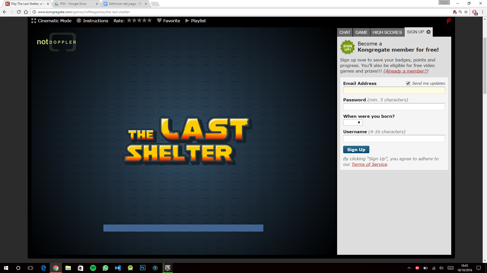

Lo primero que hace el juego es mostrar una barra de carga.

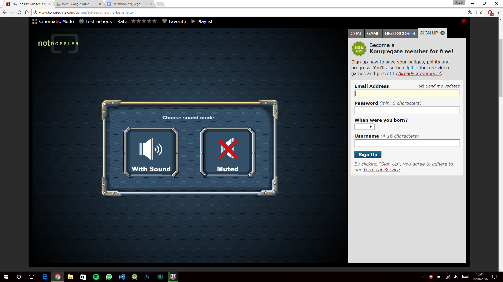

Despu&eacute;s pregunta si se quiere sonido o no. 

<ul class="c14 lst-kix_8k7mv42d2v6t-0 start"><li class="c11">Presentaci&oacute;n inicial</li></ul>

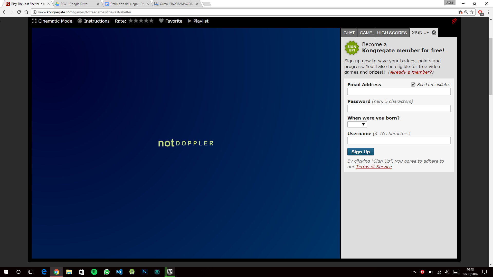

La presentaci&oacute;n inicial del juego muestra dos pantallas de precarga que anuncian a los creadores del juego. 

<ul class="c14 lst-kix_s4dc7eeh3ye6-0 start"><li class="c11">Pantalla de inicio</li></ul>

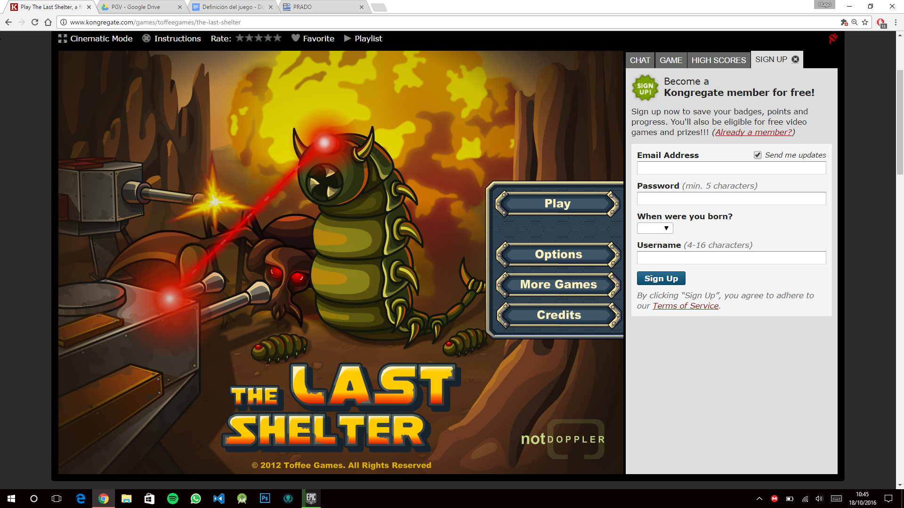

La pantalla inicio del juego muestra un fondo animado, la animaci&oacute;n consiste en una transici&oacute;n de brillo de las letras del t&iacute;tulo del juego y se muestra sobre este fondo varias opciones a elegir en forma de botones los cuales son:
<ul class="c14 lst-kix_pgfc4e7ytsq7-0 start"><li class="c3">Play: Esta opci&oacute;n muestra un nuevo men&uacute; Slots que se superpone sobre el anterior y que superpone una sombra sobre de la&nbsp;Pantalla de inicio.</li><li class="c3">Options:&nbsp;Muestra un men&uacute; que tiene elementos seleccionables: Auto Pause, Sound y Music, es decir, permite activar estas opciones o cerrar el men&uacute;.</li><li class="c3">More Games:&nbsp;Un enlace a una p&aacute;gina web.</li><li class="c3">Credits:&nbsp;Muestra un men&uacute; que muestra la informaci&oacute;n del grupo de creadores del juego y su logo y un bot&oacute;n para cerrarlo.</li></ul>

<ul class="c14 lst-kix_olcl3ebzfaid-0 start"><li class="c11">Slots</li></ul>

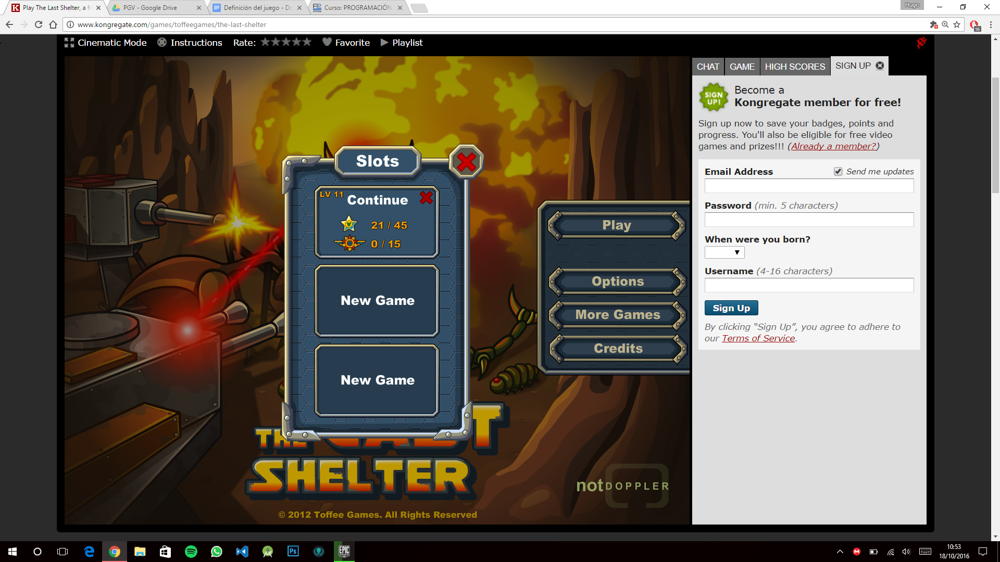

Este men&uacute; nos proporciona varias opciones: Si hemos jugado previamente y est&aacute; guardada nuestra partida en las cookies del navegador nos permitir&aacute; cargar&nbsp;la partida&nbsp;desde el nivel por el que est&aacute;bamos jugando, si no hemos jugado previamente nos da la opci&oacute;n de crear una nueva partida&nbsp;en tres Slots distintos. Por &uacute;ltimo tenemos un bot&oacute;n de salir que nos devuelve a la Pantalla de inicio. 
<ul class="c14 lst-kix_pgfc4e7ytsq7-0"><li class="c3">Nueva partida: Comienza con una pantalla con el fondo con una imagen y superponiendo texto de una historia que va contando animando dicho texto. La animaci&oacute;n consiste en que el texto va apareciendo progresivamente en un tiempo determinado. En esta pantalla muestra un bot&oacute;n de siguiente para continuar con el men&uacute; selector de niveles.</li><li class="c3">Cargar la partida:&nbsp;El bot&oacute;n de cargar te muestra en el propio bot&oacute;n, el nivel que tienes, los logros conseguidos hasta el momento en esa partida que vas a cargar y los logros en modo ultimate y un bot&oacute;n para eliminar la partida, que muestra en el propio bot&oacute;n una pregunta de confirmaci&oacute;n para eliminar la partida o no. Cuando pulsamos dicho bot&oacute;n te lleva al men&uacute; selector de niveles.</li></ul>

<ul class="c14 lst-kix_o7mqyzcllhkf-0 start"><li class="c11">Selector de niveles (Mapa del juego)</li></ul>

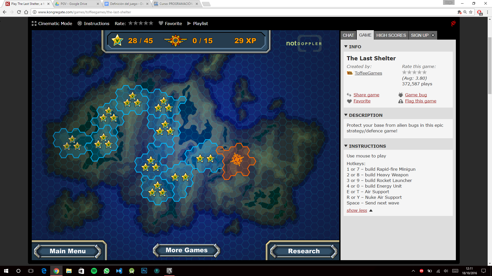

Se muestra una imagen de fondo con un mapa de un terreno en 2D, sobre esta imagen se sit&uacute;a una malla en azul de hex&aacute;gonos. Sobre esta malla se resalta una zona en naranja la cual tiene una animaci&oacute;n de una diana que apunta al lugar donde se supone que se va a centrar el lugar del primer nivel. Esta malla reacciona con una animaci&oacute;n cuando se sit&uacute;a el rat&oacute;n encima de dicha zona y es clickable para poder acceder a dicha zona del mapa o nivel del juego. Si hemos ganado logros se muestran en la zona anaranjada&nbsp;del nivel, si hemos ganado el logro ultimate s&oacute;lo se muestra dicho logro. Cuando se hace click sobre la zona anaranjada nos muestra el men&uacute; de descripci&oacute;n del nivel. Sobre el mapa se muestra en la parte superior la experiencia actual, y los logros normales y ultimate. Adem&aacute;s se muestran tres botones uno que es Main menu, otro que es More games&nbsp;y por &uacute;ltimo uno que es Research. Main menu te devuelve a la&nbsp;Pantalla de inicio,&nbsp;More games&nbsp;es una enlace a una p&aacute;gina web y Research muestra otro men&uacute; que tiene por cada tipo de mejora posible (Shooting radius, Speed of repair, Weapons armoring, Refund for selling weapons,Support recharge time, Support power) una serie de botones que ser&aacute;n desbloqueados dependiendo de la cantidad de experiencia que tengas y que puedas comprar. Si est&aacute;n bloqueados el bot&oacute;n se muestra con un fondo negro y letras blancas y si est&aacute;n desbloqueados se muestra en azul, si ha sido comprado se muestra sobre dicho bot&oacute;n el nivel en el que est&aacute; dicha mejora. Para aceptar los posibles cambios en mejoras se tiene un bot&oacute;n de DONE que las hace efectivas, sino un bot&oacute;n de CANCEL para descartar los cambios.

<ul class="c14 lst-kix_w19j28anzpl2-0 start"><li class="c11">Descripci&oacute;n del nivel(Misi&oacute;n)</li></ul>

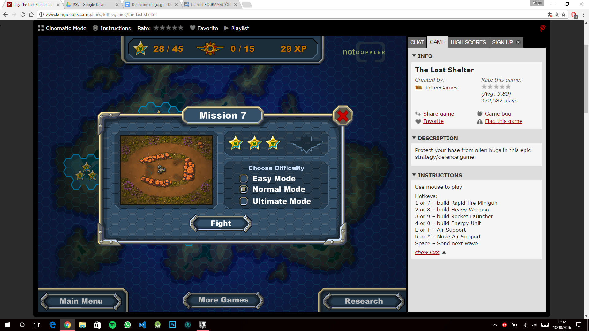

Muestra una imagen del nivel completo, los posibles logros que hayas ganado en ese nivel tanto ultimate, como normal. El nombre de la misi&oacute;n en la parte superior, un bot&oacute;n de cerrar que vuelve al selector de nivel en la parte superior derecha. A la derecha de la imagen muestra un selector de dificultad el cual s&oacute;lo tiene habilitados el nivel f&aacute;cil y normal, el modo ultimate s&oacute;lo se desbloquea cuando has obtenido los tres logros normales.

<ul class="c14 lst-kix_fwhc2vm8kpf3-0 start"><li class="c11">Pantalla de juego</li></ul>

Comienza mostrando un peque&ntilde;o tip&nbsp;avisando de que hay enemigos que se acercan a tu base, dicho tip es un peque&ntilde;o cuadro de di&aacute;logo que s&oacute;lo permite cerrarlo con un bot&oacute;n OK. Estos tip ir&aacute; apareciendo conforme tengas que evolucionar en el juego, es decir, cuando tengas algo nuevo disponible que desbloquear o necesites instrucciones para realizar alguna acci&oacute;n.

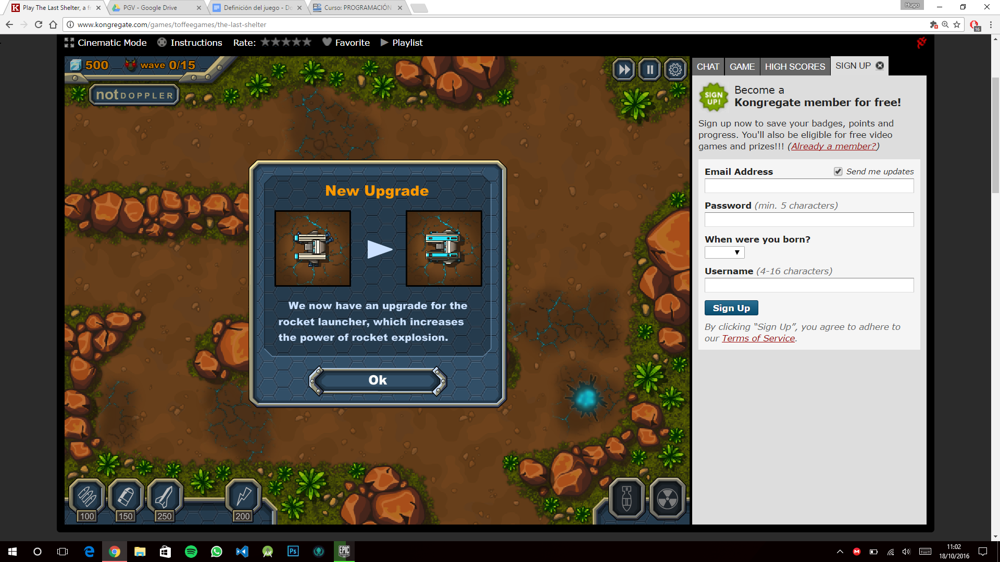

Tambi&eacute;n se muestran bocadillos&nbsp;explicativos para cualquier acci&oacute;n que tengas que realizar sobre un bot&oacute;n si se posiciona el cursor encima de dicho bot&oacute;n.

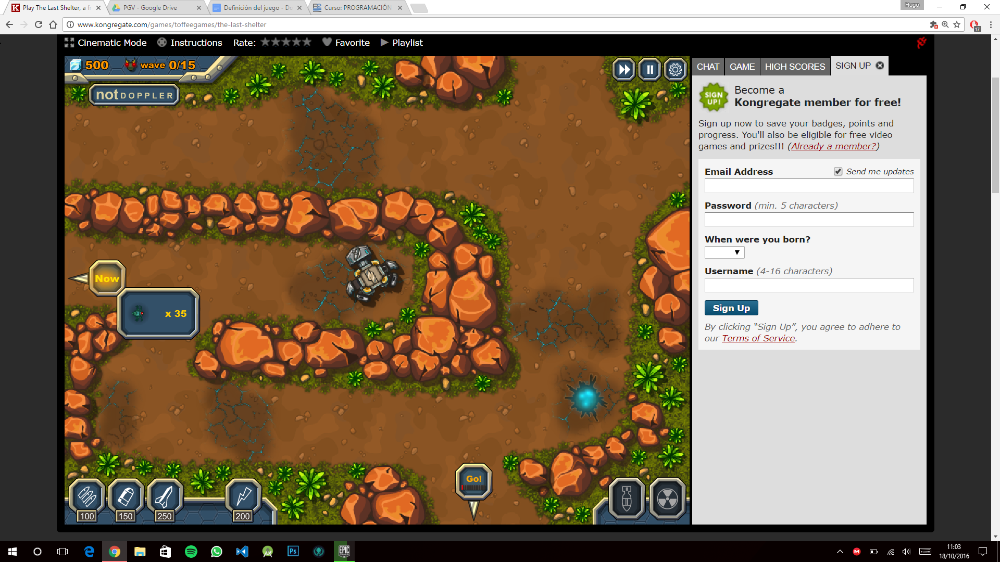

Los elementos del HUD, empezando de izquierda a derecha y de arriba a abajo, son los siguientes:
<ol class="c14 lst-kix_r321kmuim174-0 start" start="1"><li class="c3">Esquina superior izquierda: muestra los indicadores de estado del juego, es decir, muestra la cantidad de recursos de los que dispones actualmente y las oleadas que quedan por eliminar, se muestra con un icono y un valor num&eacute;rico.Justo debajo se muestra el nombre de la empresa.</li></ol>

<ol class="c14 lst-kix_r321kmuim174-0" start="2"><li class="c3">Esquina superior derecha: muestra tres botones, el primero un bot&oacute;n de avance r&aacute;pido que te permite aumentar la velocidad del juego, el segundo bot&oacute;n es un pause para pausar la partida y el tercer bot&oacute;n es un bot&oacute;n de men&uacute; que te muestra el men&uacute; de juego.</li></ol>

<ol class="c14 lst-kix_r321kmuim174-0" start="3"><li class="c3">Esquina inferior izquierda: muestra los botones de construcci&oacute;n&nbsp;de los cuales tres de ellos est&aacute;n bloqueados al principio hasta que no avanzas en el juego y puedas construir ese tipo de torre.</li></ol>

<ol class="c14 lst-kix_r321kmuim174-0" start="4"><li class="c3">Esquina inferior derecha: muestra los botones de habilidades&nbsp;que al principio est&aacute;n bloqueadas hasta que avanzas en el juego.</li></ol>

Botones de construcci&oacute;n:
<ol class="c14 lst-kix_4p5uz4ldjwyc-0 start" start="1"><li class="c3">Torres con minigun</li><li class="c3">Torres con heavy weapon </li><li class="c3">Torres lanzacohetes &nbsp; &nbsp; &nbsp;</li><li class="c3">Energy unit</li></ol>

Si pulsamos cualquiera de ellos nos aparece en el mapa una silueta de la torre seleccionada que nos permite colocar dicha torre en los sitios permitidos que se mostrar&aacute;n en el mapa con un hex&aacute;gono se&ntilde;alado en azul y tambi&eacute;n nos mostrar&aacute; esa silueta de la torre en rojo si no se puede colocar y en verde si se puede colocar y un c&iacute;rculo azul indicando el alcance dicha unidad.

Botones de habilidades
<ol class="c14 lst-kix_6p6gqkawvr1y-0 start" start="1"><li class="c3">Ataque a&eacute;reo: Muestra en el mapa un c&iacute;rculo que representa el rango del ataque y donde quieres situarlo.</li><li class="c3">Ataque nuclear: Igual que el anterior pero con un radio m&aacute;s grande.</li></ol>

Bot&oacute;n para comenzar con la horda

&nbsp;&nbsp;&nbsp;&nbsp;&nbsp;&nbsp;&nbsp;&nbsp;

Una vez hayas situado todo en el campo mediante las acciones que puedes hacer sobre los distintos men&uacute;s, ya sea construyendo torretas o usando habilidades, aparece en el lugar de donde vaya a provenir la horda un&nbsp;bot&oacute;n para comenzar con la horda.Si nos situamos sobre dicho bot&oacute;n nos aparece un peque&ntilde;o bocadillo con informaci&oacute;n sobre la horda, el tipo de enemigos con su icono y su n&uacute;mero, y tambi&eacute;n cambia el texto del bot&oacute;n a NOW, en lugar de GO. Adem&aacute;s dicho bot&oacute;n cuando terminas con una horda aparecer&aacute; de nuevo con un contador de tiempo estableciendo el tiempo que te queda para que la siguiente horda aparezca, puedes pulsar dicho bot&oacute;n sin que el tiempo se haya acabado y este desaparecer&aacute; y empezar&aacute; la horda que te gratificar&aacute; con recursos dependiendo del tiempo y se mostrar&aacute; en la posici&oacute;n en la que estaba el bot&oacute;n que pulsaste un icono con el n&uacute;mero de recursos ganados que desaparecer&aacute; al poco tiempo.

Barra de vida:&nbsp;En el mapa tambi&eacute;n se muestra sobre nuestras torres y sobre los enemigos una barra de vida&nbsp;que nos indica cuanta vida le queda a la torre o enemigo.

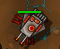&nbsp;&nbsp;&nbsp;&nbsp;&nbsp;&nbsp;&nbsp;&nbsp;&nbsp;&nbsp;&nbsp;&nbsp;&nbsp;&nbsp;&nbsp;&nbsp;&nbsp;&nbsp;&nbsp;&nbsp;&nbsp;&nbsp;&nbsp;&nbsp;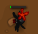

Men&uacute; de las torretas

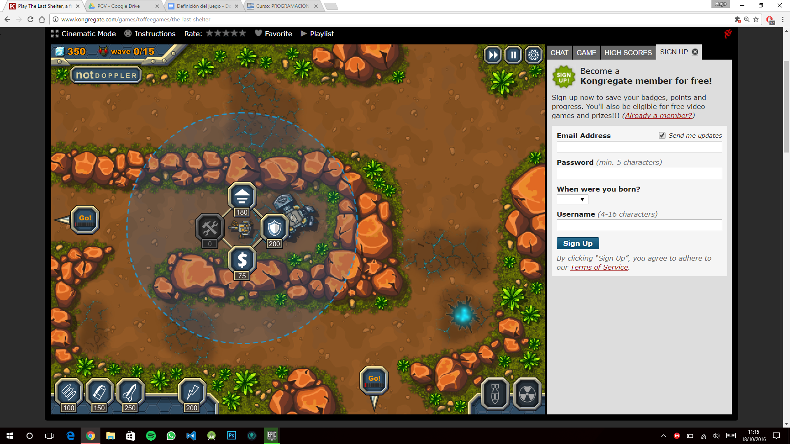

Este men&uacute; s&oacute;lo se activa cuando hacemos clic sobre una torreta y muestra el rango del alcance de esa torreta en el mapa y un men&uacute; de cuatro opciones en el HUD:
<ol class="c14 lst-kix_2bmuwufw8w03-0 start" start="1"><li class="c3">Reparar la torre: Muestra el precio de repararla en recursos</li><li class="c3">Vender la torre: Muestra el precio de venderla en recursos</li><li class="c3">Mejorar la torre: Muestra el precio de mejorar el nivel de la torre</li><li class="c3">Escudo: Muestra el precio de colocar un escudo en la torre</li></ol>

Fin de partida: Muestra un cuadro de di&aacute;logo el resultado que has obtenido, si es victoria o derrota, con una animaci&oacute;n sobre el texto la misma que para el texto de la pantalla de inicio. Tiene cuatro &iacute;tems:
<ol class="c14 lst-kix_u6kdqtpknpkq-0 start" start="1"><li class="c3">Logro Area Cleaned: Con un texto que explica en qu&eacute; consiste el logro y con un icono de estrella si lo has conseguido o una estrella vac&iacute;a en el caso de que no.</li><li class="c3">Logro Weapon Stamina: Lo mismo que el anterior.</li><li class="c3">Logro Invencible base: Lo mismo que el anterior.</li><li class="c3">Experiencia ganada que muestra en un cuadro la cantidad de experiencia ganada.</li><li class="c3">Continue que te lleva al men&uacute; de Selector de niveles (Mapa del juego).</li><li class="c3">Restart que reinicia el nivel.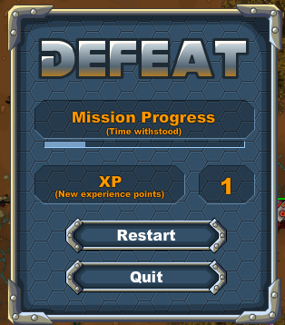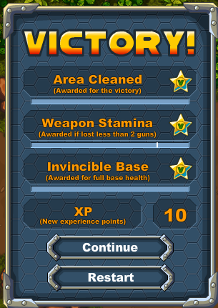</li></ol>

<h1 class="c34 c22" id="h.4w129b3zxp4c">DEFINICI&Oacute;N DE BICHOS</h1><h2 class="c8" id="h.qusnt3m56udm">Todos los bichos</h2>

Atributos
<ul class="c14 lst-kix_uay10l58nqpf-0 start"><li class="c0">ID:&nbsp;Atributo est&aacute;tico. Valor num&eacute;rico discreto que identifica el tipo de bicho que es.</li></ul><ul class="c14 lst-kix_um81vytb1ytz-0 start"><li class="c0">Vida:&nbsp;Atributo est&aacute;tico. Valor num&eacute;rico continuo de 0 a 100. Decrece conforme recibe ataques.</li><li class="c0">Tipo de ataque: Atributo est&aacute;tico. valor num&eacute;rico discreto. Especifica distintos tipos de ataque que pueden ser &ldquo;pegando&rdquo;, &ldquo;disparando&rdquo; o en &aacute;ngulo a un &aacute;rea espec&iacute;fica (que puede atacar m&aacute;s de una torre a la vez) OPTATIVO&nbsp;SEG&Uacute;N EL TIEMPO QUE TENGAMOS.</li><li class="c0">Fuerza de ataque:&nbsp;Atributo est&aacute;tico. Valor num&eacute;rico discreto de 0 a 100. Indica el da&ntilde;o que har&aacute; a las torres.</li><li class="c0">Alcance de ataque:&nbsp;Atributo est&aacute;tico. Valor num&eacute;rico discreto que indica el radio de la circunferencia en la que el bicho podr&aacute; atacar. OPTATIVO&nbsp;SEG&Uacute;N TIPO DE ATAQUE</li><li class="c0">Frecuencia de ataque:&nbsp;Atributo est&aacute;tico. Valor num&eacute;rico discreto de 0 a 100. Indica el tiempo que pasa entre dos ataques consecutivos.</li><li class="c0">Velocidad movimiento:&nbsp;Atributo est&aacute;tico. Valor num&eacute;rico discreto de 0 a 100. Especifica la distancia que recorre por unidad de tiempo.</li><li class="c0">Posici&oacute;n:&nbsp;Atributo din&aacute;mico. Coordenadas x,z,y discretos que indiquen la posici&oacute;n del bicho en el mapa.</li><li class="c0">Esfera englobante:&nbsp;Atributo est&aacute;tico. Esfera de radio m&iacute;nimo que engloba a todo el bicho.</li><li class="c0">Recompensa de muerte:&nbsp;Atributo est&aacute;tico. Recompensa de recursos por matar al bicho.</li></ul>

Estados&nbsp;
<ul class="c14 lst-kix_vyntah4h10e1-0 start"><li class="c0">En espera&nbsp;-&gt; Esperando al evento de salida de la horda.</li></ul><ul class="c14 lst-kix_l13h1tor080c-0 start"><li class="c0">En movimiento&nbsp;-&gt; siguiendo la trayectoria hacia la base.</li><li class="c0">Colisi&oacute;n con otro bicho -&gt; modificaci&oacute;n de trayectoria</li><li class="c0">Llegada a alguna torre&nbsp;-&gt; atacar torre</li><li class="c0">Llegada a base&nbsp;-&gt; atacar base</li><li class="c0">Muerto -&gt; Se queda sin vida -&gt; desaparece del juego</li></ul>

<h2 class="c8" id="h.woaxuq391iha">Bicho bajo</h2><ul class="c14 lst-kix_um81vytb1ytz-0"><li class="c0">ID -&gt; 1</li><li class="c0">Vida&nbsp; -&gt; 20</li><li class="c0">Fuerza de ataque&nbsp;-&gt; 10</li><li class="c0">Frecuencia de ataque&nbsp;-&gt; 10</li><li class="c0">Velocidad movimiento&nbsp;-&gt; 50</li><li class="c0">Recompensa de muerte:&nbsp;-&gt; 2</li></ul>

<h2 class="c8" id="h.ysdx69rqm9hh">Bicho medio</h2><ul class="c14 lst-kix_um81vytb1ytz-0"><li class="c0">ID -&gt; 2</li><li class="c0">Vida&nbsp; -&gt;40</li><li class="c0">Fuerza de ataque&nbsp;-&gt; 20</li><li class="c0">Frecuencia de ataque&nbsp;-&gt; 30</li><li class="c0">Velocidad movimiento&nbsp;-&gt;50</li><li class="c0">Recompensa de muerte:&nbsp;-&gt; 4</li></ul>

<h2 class="c8" id="h.gs0sdv10f7w6">Bicho alto</h2><ul class="c14 lst-kix_um81vytb1ytz-0"><li class="c0">ID -&gt; 3</li><li class="c0">Vida&nbsp; -&gt;70</li><li class="c0">Fuerza de ataque&nbsp;-&gt; 40</li><li class="c0">Frecuencia de ataque&nbsp;-&gt; 50</li><li class="c0">Velocidad movimiento&nbsp;-&gt; 50</li><li class="c0">Recompensa de muerte:&nbsp;-&gt; 8</li></ul>

<h2 class="c8" id="h.60vesdua79at">Super Bicho</h2><ul class="c14 lst-kix_um81vytb1ytz-0"><li class="c0">ID -&gt; 4</li><li class="c0">Vida&nbsp; -&gt; 100</li><li class="c0">Fuerza de ataque&nbsp;-&gt; 60</li><li class="c0">Frecuencia de ataque&nbsp;-&gt; 50</li><li class="c0">Velocidad movimiento&nbsp;-&gt; 50</li><li class="c0">Recompensa de muerte:&nbsp;-&gt; 16</li></ul>

<h2 class="c25 c22" id="h.gnvsxdpz3jk7">Diagrama de estados</h2>

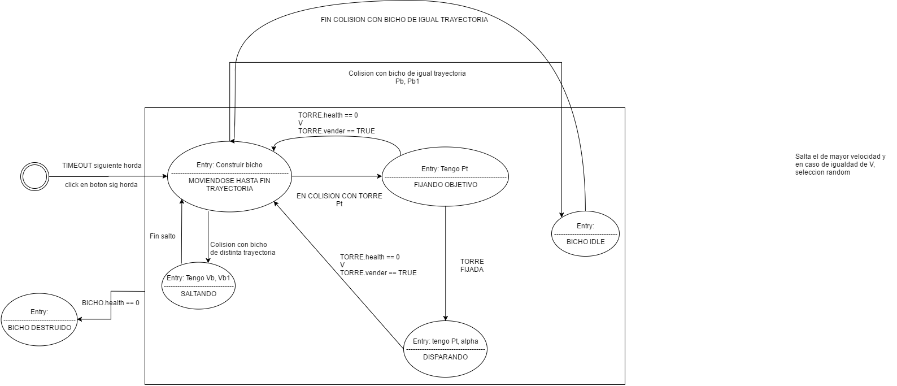

<h1 class="c34 c22" id="h.r0dtn1cl31ny">DEFINICI&Oacute;N DE TORRES</h1><h2 class="c8" id="h.luw2d04xamic">Todos las torres</h2>

Atributos
<ul class="c14 lst-kix_aggr62u6tz7f-0 start"><li class="c0">Vida: Atributo din&aacute;mico cantidad de 0 a 100, decrece cuando recibe ataques.(Aumenta con el nivel de la torreta con un factor de 1.2 por nivel*).</li><li class="c0">Precio: Atributo est&aacute;tico. El precio de la mejora depender&aacute; del precio base de la torreta + un incremento del nivel de la mejora.</li><li class="c0">Precio de venta: Atributo din&aacute;mico. Aumenta con el nivel de mejora. Disminuye en funci&oacute;n de la vida restante.</li><li class="c0">Incremento del precio por nivel: Atributo est&aacute;tico. Incremento en el precio de cada mejora.</li><li class="c0">Nivel:Atributo din&aacute;mico. Indica cuantas mejoras se han aplicado a la torre. Valores={1,2,3}.</li><li class="c0">ID: Atributo est&aacute;tico. Indica el tipo de torreta</li><li class="c0">Posici&oacute;n: Atributo est&aacute;tico. Coordenadas x, y, z discretos que indiquen la posici&oacute;n de la torreta en el mapa.</li><li class="c0">Escudo: Objeto escudo asociado.</li><li class="c0">Caja Englobante&nbsp;-&gt; Cubo de tama&ntilde;o m&iacute;nimo que engloba a la torre.</li></ul>

Estados&nbsp;
<ul class="c14 lst-kix_64pp5vxz9vlv-0 start"><li class="c0">En espera&nbsp;-&gt; Esperando al evento de salida de la horda.</li><li class="c0">En reparaci&oacute;n -&gt; Reparando los da&ntilde;os producidos.</li><li class="c0">Atacado -&gt; Recibiendo da&ntilde;os de los bichos</li></ul><ul class="c14 lst-kix_59nr8xbbj9bi-0 start"><li class="c0">Destruida -&gt; Se queda sin vida -&gt; desaparece del juego.</li></ul>

<h2 class="c8" id="h.rlobxiegir8">Torres de ataque</h2><ul class="c14 lst-kix_dcwc2gdgrvbf-0 start"><li class="c0">Alcance: Atributo est&aacute;tico. Radio en el cual es capaz de atacar a los enemigos. Aumenta con las mejoras.</li><li class="c0">Da&ntilde;o: Atributo est&aacute;tico. Vida que le quita a los enemigos en cada disparo. Podr&iacute;a aumentar dependiendo del nivel de mejora.(Aumenta con el nivel de la torreta con un factor por nivel que podr&aacute; ser reajustado para ajustar la din&aacute;mica del juego).</li><li class="c0">Ratio de disparo: Atributo est&aacute;tico. Tiempo que pasa entre dos disparos consecutivos. Aumentar con las mejora.</li><li class="c0">Radio de explosi&oacute;n: Atributo est&aacute;tico. Indica el rango de efecto del proyectil (para cohetes).</li><li class="c0">Bicho objetivo</li></ul>

Estados&nbsp;(adem&aacute;s de los anteriores)
<ul class="c14 lst-kix_2e2u58r9i6rw-0 start"><li class="c0">Apuntando -&gt; Cuando un bicho entra en el radio de ataque.</li></ul><ul class="c14 lst-kix_64pp5vxz9vlv-0"><li class="c0">Atacando&nbsp;-&gt; Disparando a los bichos.</li></ul>

<h2 class="c8" id="h.tr7cg3pe5m31">Torre recolectora:</h2><ul class="c14 lst-kix_k1o2x8wlkk3r-0 start"><li class="c0">Ratio de recolecci&oacute;n: Atributo est&aacute;tico. Podr&iacute;a aumentar dependiendo del nivel de mejora.</li><li class="c0">Cantidad de la recolecci&oacute;n: Atributo est&aacute;tico. Podr&iacute;a aumentar dependiendo del nivel de mejora.</li><li class="c0">Incremento del precio de mejora: Atributo est&aacute;tico. Indica cu&aacute;nto aumenta el precio de cada mejora. +100 en el precio de cada mejora.</li></ul>

Estados&nbsp;(adem&aacute;s de los anteriores)
<ul class="c14 lst-kix_64pp5vxz9vlv-0"><li class="c0">Recolectando-&gt; Obteniendo recursos.</li></ul>

<h2 class="c8" id="h.115n8cnz5tia">Escudo</h2><ul class="c14 lst-kix_opdu5ijgteqc-0 start"><li class="c0">Duraci&oacute;n: Atributo est&aacute;tico. Tiempo que tarda en desaparecer. Aumenta con mejoras.</li><li class="c0">Precio: Atributo est&aacute;tico. Cantidad de recursos que perdemos al construirla</li></ul>

Estados
<ul class="c14 lst-kix_64pp5vxz9vlv-0"><li class="c0">En espera -&gt; No se ha colocado ning&uacute;n escudo en la torre.</li><li class="c0">Protegiendo&nbsp;-&gt; Defendiendo a la torre de ser atacada</li><li class="c0">Fin del tiempo -&gt; Pasa el tiempo de duraci&oacute;n y desaparece del mapa. &iquest;Ser&iacute;a m&aacute;s bien un desencadenante?</li><li class="c0">Destruido -&gt; Los bichos han destrozado el escudo y desaparece del mapa</li></ul>

<h2 class="c8" id="h.4m0xxbejpieh">Base</h2><ul class="c14 lst-kix_tkoe7z5libop-0 start"><li class="c0">Vida: 50</li></ul>

<h2 class="c8" id="h.8cyb05k9gyhb">Torreta ametralladora</h2><ul class="c14 lst-kix_aggr62u6tz7f-0"><li class="c0">Vida: 30</li><li class="c0">Precio: 100</li><li class="c0">Nivel: 1</li><li class="c0">ID: 1</li><li class="c0">Alcance: 20</li><li class="c0">Da&ntilde;o: 5</li><li class="c0">Ratio de disparo: 4 balas/segundo</li><li class="c0">Radio de explosi&oacute;n: -</li><li class="c0">Incremento de precio de mejora: +20</li></ul>

<h2 class="c8" id="h.pf6non3jtns6">Torreta ca&ntilde;&oacute;n</h2><ul class="c14 lst-kix_aggr62u6tz7f-0"><li class="c0">Vida: 30</li><li class="c0">Precio: 150</li><li class="c0">Nivel: 1</li><li class="c0">ID: 2</li><li class="c0">Alcance: 20</li><li class="c0">Da&ntilde;o: 20</li><li class="c0">Ratio de disparo: 1 bala cada 3 segundos</li><li class="c0">Radio de explosi&oacute;n: -</li><li class="c0">Incremento de precio de mejora: +30</li></ul>

<h2 class="c8" id="h.9l7si2gl80g2">Torreta de misiles</h2><ul class="c14 lst-kix_aggr62u6tz7f-0"><li class="c0">Vida: 20</li><li class="c0">Precio: 250</li><li class="c0">Nivel: 1</li><li class="c0">ID: 3</li><li class="c0">Alcance: 25</li><li class="c0">Da&ntilde;o: 50</li><li class="c0">Ratio de disparo: 1 misil cada 5 segundos</li><li class="c0">Radio de explosi&oacute;n: 5</li><li class="c0">Incremento de precio de mejora: +0, +20</li></ul>

<h2 class="c8" id="h.7v8mo29j5nhr">Diagrama de estados</h2>

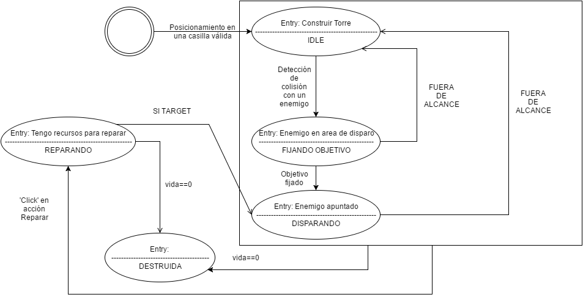

<h1 class="c72 c22 c56" id="h.b7mh6t8jmfjx"></h1><h1 class="c22 c72" id="h.lqlih3tawq0a">DEFINICI&Oacute;N DE MEJORAS</h1>
Descripci&oacute;n

Las mejoras se adquieren con puntos de experiencia (XP). &Eacute;stos se consiguen en las siguientes situaciones y cantidad:
<ul class="c14 lst-kix_bpd81013v51x-0 start"><li class="c13 c31">Por cada logro conseguido obtenemos 10 XP</li><li class="c13 c31">Si perdemos y destruyen nuestra base ganamos XP en funci&oacute;n del progreso de la misi&oacute;n.</li></ul>

Cada mejora se puede actualizar hasta 3 niveles y cada una de estas actualizaciones costar&aacute; 20 XP, 25 XP y 30 XP respectivamente.

Atributos:

Atributos comunes a todas las mejoras:

&nbsp;&nbsp;&nbsp;&nbsp;&nbsp;&nbsp;&nbsp;&nbsp;Atributo din&aacute;mico: Nivel; valores = {0,1,2,3}.

&nbsp;&nbsp;&nbsp;&nbsp;&nbsp;&nbsp;&nbsp;&nbsp;Atributo din&aacute;mico: Coste de actualizaci&oacute;n; valores = {20,25,30}.

Atributos de Shooting radius:

&nbsp;&nbsp;&nbsp;&nbsp;&nbsp;&nbsp;&nbsp;&nbsp;Atributo est&aacute;tico: Factor de incremento de radio de alcance

Atributos de Speed of repair:

&nbsp;&nbsp;&nbsp;&nbsp;&nbsp;&nbsp;&nbsp;&nbsp;Atributo est&aacute;tico: Factor de incremento de velocidad de reparaci&oacute;n

Atributos de Weapons armoring:

Atributo est&aacute;tico: Factor de incremento de salud

Atributos de Refund for selling weapons:

&nbsp;&nbsp;&nbsp;&nbsp;&nbsp;&nbsp;&nbsp;&nbsp;Atributo est&aacute;tico: Factor de incremento de valor de venta

Atributos de Support recharge time:

&nbsp;&nbsp;&nbsp;&nbsp;&nbsp;&nbsp;&nbsp;&nbsp;Atributo est&aacute;tico: Factor de decremento de tiempo de recarga de objetos especiales

Atributos de Support power:

&nbsp;&nbsp;&nbsp;&nbsp;&nbsp;&nbsp;&nbsp;&nbsp;Atributo est&aacute;tico: Factor de incremento de potencia de objetos especiales

Para todas las mejoras, se multiplicar&iacute;a el nivel actual de cada una por su factor de incremento/decremento correspondiente con el fin de obtener su capacidad total de mejora.

<h1 class="c34 c22" id="h.swky9h5hzro5">DEFINICI&Oacute;N DEL MAPA</h1><h2 class="c8" id="h.vvi0r3rp4bbc">Todos los mapas</h2>

Atributos 
<ul class="c14 lst-kix_qzvc6rc82vgi-0 start"><li class="c0">Recursos iniciales: Atributo est&aacute;tico. Indica la cantidad de recursos iniciales para ese nivel.</li><li class="c0">N&uacute;mero de oleadas: Atributo est&aacute;tico. Indica el n&uacute;mero de rondas que deber&aacute; resistir el jugador para ganar el nivel.</li><li class="c0">Oleada actual: Atributo din&aacute;mico. Indica el n&uacute;mero de oleada en la que se encuentra el jugador.</li><li class="c0">Dificultad: Atributo est&aacute;tico. Indica la dificultad del nivel. Valores={F&aacute;cil,Normal,Ultimate}. Cada nivel de dificultad aumentar&aacute; el n&uacute;mero de enemigos que aparezcan por oleada.</li><li class="c0">ID: Atributo est&aacute;tico.</li><li class="c0">Tipo de terreno: Atributo est&aacute;tico. Una lista de posiciones del mapa que indica que tipo de terreno es cada posici&oacute;n. Valores:</li></ul><ul class="c14 lst-kix_qzvc6rc82vgi-1 start"><li class="c13 c31">Pared no ocupable: Posici&oacute;n del mapa no ocupable por ning&uacute;n objeto jugable.</li><li class="c13 c31">Suelo v&aacute;lido: Posici&oacute;n por la que los enemigos podr&aacute;n moverse.</li><li class="c13 c31">Posici&oacute;n de torreta libre: Posici&oacute;n que indica donde puede construirse una torreta de ataque.</li><li class="c13 c31">Posici&oacute;n de torreta ocupada: Posici&oacute;n que indica donde est&aacute; construida una torreta de ataque.</li><li class="c13 c31">Posici&oacute;n de extracci&oacute;n de recursos libre: Posici&oacute;n que indica donde puede colocarse una torreta de recursos.</li><li class="c13 c31">Posici&oacute;n de extracci&oacute;n de recursos ocupada: Posici&oacute;n que indica donde se ha colocado una torreta de recursos.</li></ul><ul class="c14 lst-kix_qzvc6rc82vgi-0"><li class="c0">Cantidad de recompensa por oleada: Atributo est&aacute;tico. Indica los recursos de recompensa que se obtienen al terminar una oleada. En funci&oacute;n de la velocidad a la que el jugador termine la ronda y de paso a la siguiente mediante un click en siguiente oleada, se ganar&aacute;n m&aacute;s o menos recursos.</li><li class="c0">Tipos de torretas permitidas en el nivel: Atributo est&aacute;tico. Indica las torretas que podr&aacute;n usarse en el nivel. Valores = {Torreta ametralladora, Torreta ca&ntilde;&oacute;n, Torreta lanzacohetes, Torreta recolectora}.</li><li class="c0">Tipos de acciones de torretas permitidas en el nivel: Atributo est&aacute;tico. Indica las acciones disponibles al hacer clic en una torreta colocada. Valores={Vender, Mejorar, Reparar, Escudo}.</li><li class="c0">Tipos de habilidades permitidas en el nivel: Atributo est&aacute;tico. Indica las habilidades que puede usar el jugador en el nivel. Valores = {Bombardeo, Misil nuclear}.</li><li class="c0">Oleadas: Atributo est&aacute;tico. Colecci&oacute;n de tipos de enemigos que indicar&aacute;n los enemigos que aparecer&aacute;n en dicha oleada.</li><li class="c0">Experiencia final:&nbsp;Atributo est&aacute;tico. Indica la cantidad de experiencia que obtiene el jugador por ganar el nivel. Esta experiencia depender&aacute; de la calidad de c&oacute;mo haya resuelto el nivel.</li></ul>

<h2 class="c8" id="h.c49hqyvvr1bu">Oleada</h2><ul class="c14 lst-kix_od41nm9snt8f-0 start"><li class="c0">Tipos de enemigos: Atributo est&aacute;tico. Valores = {Tipos de enemigos}. Un array de tipos de enemigos que se ir&aacute;n lanzando en la oleada. Cada posici&oacute;n del array identificar&aacute; a un tipo de enemigo y el valor de la posici&oacute;n indicar&aacute; la cantidad de enemigos de ese tipo.</li></ul>

<h1 class="c34 c22" id="h.bkc7i0ps6oka">DEFINICI&Oacute;N DE LOS NIVELES</h1>

<h2 class="c8" id="h.ajy8j286i5jh">Nivel 1</h2>
Atributos 
<ul class="c14 lst-kix_qzvc6rc82vgi-0"><li class="c0">Recursos iniciales: 600.</li><li class="c0">N&uacute;mero de oleadas: 5.</li><li class="c0">Dificultad: Valores={F&aacute;cil 0.8,Normal 1,Ultimate 1.2}. </li><li class="c0">ID: 0.</li><li class="c0">Cantidad de recompensa por oleada: 8 de recursos por cada segundo restante hasta que se lance autom&aacute;ticamente la oleada.</li><li class="c0">Tipos de torretas permitidas en el nivel: Valores = {Torreta ametralladora, Torreta ca&ntilde;&oacute;n, X, X}.</li><li class="c0">Tipos de acciones de torretas permitidas en el nivel: Valores={Vender, Mejorar, Reparar, X}.</li><li class="c0">Tipos de habilidades permitidas en el nivel:Valores = {Bombardeo, X}.</li><li class="c0">Oleadas: Valores = {</li></ul><ul class="c14 lst-kix_qzvc6rc82vgi-1 start"><li class="c13 c31">{Oleada0(20,0s,T1),(5,10sT2)}</li><li class="c13 c31">{Oleada1(15,0s),(12,3s)},</li><li class="c13 c31">{Oleada2(20,0s,T1),(5,10s,T2),(10,20s,T1)},</li><li class="c13 c31">{Oleada3(20,0s,T1),(9,10s,T2),(15,20s,T1),(15,20s,T2)},</li><li class="c13 c31">{Oleada4(30,0s,T1),(9,10s,T2),(15,20s,T1),(17,20s,T2)},</li></ul><ul class="c14 lst-kix_qzvc6rc82vgi-0"><li class="c0">}</li><li class="c0">Experiencia final:&nbsp;10xp por logro completado.</li></ul>

<h2 class="c8" id="h.71jcy6wp0rje">Nivel 2</h2>
Atributos 
<ul class="c14 lst-kix_qzvc6rc82vgi-0"><li class="c0">Recursos iniciales: 400.</li><li class="c0">N&uacute;mero de oleadas: 7.</li><li class="c0">Dificultad: Valores={F&aacute;cil 0.8,Normal 1,Ultimate 1.2}. </li><li class="c0">ID: 0.</li><li class="c0">Cantidad de recompensa por oleada: 8 de recursos por cada segundo restante hasta que se lance autom&aacute;ticamente la oleada.</li><li class="c0">Tipos de torretas permitidas en el nivel: Valores = {Torreta ametralladora, Torreta ca&ntilde;&oacute;n, Torreta lanzacohetes, Torreta recolectora}.</li><li class="c0">Tipos de acciones de torretas permitidas en el nivel: Valores={Vender, Mejorar, Reparar, Escudo}.</li><li class="c0">Tipos de habilidades permitidas en el nivel:Valores = {Bombardeo, X}.</li><li class="c0">Oleadas: Valores = {</li></ul><ul class="c14 lst-kix_qzvc6rc82vgi-1 start"><li class="c13 c31">{Oleada0(20,0s,T1),(5,10sT2)}</li><li class="c13 c31">{Oleada1(15,0s),(12,3s)},</li><li class="c13 c31">{Oleada2(20,0s,T1),(5,10s,T2),(10,20s,T1)},</li><li class="c13 c31">{Oleada3(20,0s,T1),(9,10s,T2),(15,20s,T1),(15,20s,T2)},</li><li class="c13 c31">{Oleada4(30,0s,T1),(9,10s,T2),(15,20s,T1),(17,20s,T2)},</li></ul><ul class="c14 lst-kix_qzvc6rc82vgi-0"><li class="c0">}</li><li class="c0">Experiencia final:&nbsp;10xp por logro completado.</li></ul>

<h2 class="c8" id="h.un11n6d3tvuf">Nivel 3</h2>
Atributos 
<ul class="c14 lst-kix_qzvc6rc82vgi-0"><li class="c0">Recursos iniciales: 400.</li><li class="c0">N&uacute;mero de oleadas: 8.</li><li class="c0">Dificultad: Valores={F&aacute;cil 0.8,Normal 1,Ultimate 1.2}. </li><li class="c0">ID: 0.</li><li class="c0">Cantidad de recompensa por oleada: 8 de recursos por cada segundo restante hasta que se lance autom&aacute;ticamente la oleada.</li><li class="c0">Tipos de torretas permitidas en el nivel: Valores = {Torreta ametralladora, Torreta ca&ntilde;&oacute;n, Torreta lanzacohetes, Torreta recolectora}.</li><li class="c0">Tipos de acciones de torretas permitidas en el nivel: Valores={Vender, Mejorar, Reparar, Escudo}.</li><li class="c0">Tipos de habilidades permitidas en el nivel:Valores = {Bombardeo, &nbsp;Misil nuclear}.</li><li class="c0">Oleadas: Valores = {</li></ul><ul class="c14 lst-kix_qzvc6rc82vgi-1 start"><li class="c13 c31">{Oleada0(20,0s,T1),(5,10sT2)}</li><li class="c13 c31">{Oleada1(15,0s),(12,3s)},</li><li class="c13 c31">{Oleada2(20,0s,T1),(5,10s,T2),(10,20s,T1)},</li><li class="c13 c31">{Oleada3(20,0s,T1),(9,10s,T2),(15,20s,T1),(15,20s,T2)},</li><li class="c13 c31">{Oleada4(30,0s,T1),(9,10s,T2),(15,20s,T1),(17,20s,T2)},</li></ul><ul class="c14 lst-kix_qzvc6rc82vgi-0"><li class="c0">}</li><li class="c0">Experiencia final:&nbsp;10xp por logro completado.</li></ul>

<h1 class="c34 c22 c56" id="h.we4pnd9dxdgo"></h1>
<h1 class="c34 c22 c56" id="h.9p1c7yx8yceo"></h1><h1 class="c34 c22" id="h.m4gbp1qgd9zc">REGLAS</h1><h2 class="c8" id="h.54u0tmjy36ed">TORRES</h2>

<table class="c28"><tbody><tr class="c26"><td class="c23 c32" colspan="1" rowspan="1">
Apuntar a bicho
</td></tr><tr class="c26"><td class="c23" colspan="1" rowspan="1"><ul class="c14 lst-kix_6dkeautvf1cs-0 start"><li class="c2">Para fijar objetivo, debe haber un bicho dentro del rango.</li><li class="c2">Solo se puede fijar un &uacute;nico objetivo.</li><li class="c2">No se puede cambiar de objetivo fijado hasta que el bicho muera o salga del alcance.</li><li class="c2">Si varios bichos detectados, se fija como objetivo el enemigo m&aacute;s cercano a la torre.</li><li class="c2">No se puede fijar un objetivo que est&eacute; detr&aacute;s de una pared del mapa.</li></ul></td></tr></tbody></table>

<table class="c28"><tbody><tr class="c26"><td class="c23 c32" colspan="1" rowspan="1">
Atacar a bicho
</td></tr><tr class="c67"><td class="c23" colspan="1" rowspan="1"><ul class="c14 lst-kix_6dkeautvf1cs-0"><li class="c2">La torre atacar&aacute; al objetivo.</li><li class="c2">Solo se puede disparar a un bicho mientras sea el objetivo.</li><li class="c2">Mientras disparando objetivo, objetivo.vida -= torre.da&ntilde;o</li><li class="c2">El da&ntilde;o realizado se ajustar&aacute; al valor proporcionado por el algoritmo de c&aacute;lculo de da&ntilde;o especificado al final de este documento.</li></ul></td></tr></tbody></table>

<table class="c28"><tbody><tr class="c26"><td class="c23 c32" colspan="1" rowspan="1">
Reparar torre
</td></tr><tr class="c26"><td class="c23" colspan="1" rowspan="1"><ul class="c14 lst-kix_6dkeautvf1cs-0"><li class="c2">La reparaci&oacute;n ser&aacute; voluntaria y manual.</li><li class="c2">Solo se podr&aacute; reparar si hay recursos suficientes.</li><li class="c2">Solo se podr&aacute; reparar si la vida de la torreta est&aacute; por debajo del 100%.</li><li class="c2">El coste de la reparaci&oacute;n se cobrar&aacute; justo al ordenarla.</li><li class="c2">El coste de la reparaci&oacute;n depender&aacute; de la vida que le falte a la torre en el momento de la reparaci&oacute;n. coste = maxHealth - currentHealth</li><li class="c2">Una torre podr&aacute; recibir da&ntilde;o mientras se est&aacute; reparando.</li><li class="c2">Solo se reparar&aacute; la cantidad de vida pagada en el momento de ordenar la reparaci&oacute;n.</li><li class="c2">No puede cancelarse la reparaci&oacute;n.</li><li class="c2">Mientras se est&aacute; reparando la torre no puede disparar ni apuntar.</li><li class="c2">Si click en reparar y currentHealth &lt; maxHealth, guardamos maxHealth - currentHealth y cada X tiempo incrementamos currentHealth y decrementamos el Health guardado y repetimos hasta que Health guardado == 0</li></ul></td></tr></tbody></table>

<table class="c28"><tbody><tr class="c26"><td class="c23 c32" colspan="1" rowspan="1">
Colocar escudo
</td></tr><tr class="c26"><td class="c23" colspan="1" rowspan="1"><ul class="c14 lst-kix_6dkeautvf1cs-0"><li class="c2">Solo se puede utilizar si se tienen recursos suficientes.</li><li class="c2">Absorber&aacute; todo el da&ntilde;o recibido de la torre hasta que se acabe la duraci&oacute;n del escudo o baje la vida del escudo a 0.</li><li class="c2">El escudo tendr&aacute; una duraci&oacute;n determinada.</li><li class="c2">El coste de colocar el escudo es el mismo para todas las torretas.</li></ul></td></tr></tbody></table>

<table class="c28"><tbody><tr class="c26"><td class="c23 c32" colspan="1" rowspan="1">
Mejorar torre
</td></tr><tr class="c26"><td class="c23" colspan="1" rowspan="1"><ul class="c14 lst-kix_6dkeautvf1cs-0"><li class="c2">Acci&oacute;n voluntaria y manual.</li><li class="c2">S&oacute;lo se puede mejorar si se tienen recursos suficientes.</li><li class="c2">S&oacute;lo podr&aacute; mejorarse una torre hasta nivel 3 como m&aacute;ximo.</li><li class="c2">Al mejorar una torre se incrementar&aacute; el precio de venta de una torre.</li><li class="c2">Al mejorar una torre se incrementar&aacute; el da&ntilde;o de esta, la cadencia de disparo y el radio de explosi&oacute;n (solo para el lanzacohetes).</li><li class="c2">El coste es el mismo para todas las torretas.</li></ul></td></tr></tbody></table>

<table class="c28"><tbody><tr class="c26"><td class="c23 c32" colspan="1" rowspan="1">
Vender torre
</td></tr><tr class="c26"><td class="c23" colspan="1" rowspan="1"><ul class="c14 lst-kix_6dkeautvf1cs-0"><li class="c2">Acci&oacute;n voluntaria y manual.</li><li class="c2">Solo se puede vender una torre viva.</li><li class="c2">Los recursos obtenidos al vender depender&aacute; del tipo de torreta y nivel de mejora. recursos obtenidos = (costeBase / 2) * nivelMejora</li><li class="c2">Al vender la torre el espacio ocupado por la torre volver&aacute; a estar disponible para colocar una nueva torre.</li></ul></td></tr></tbody></table>

<table class="c28"><tbody><tr class="c26"><td class="c23 c32" colspan="1" rowspan="1">
Colocar torre
</td></tr><tr class="c26"><td class="c23" colspan="1" rowspan="1"><ul class="c14 lst-kix_6dkeautvf1cs-0"><li class="c2">Acci&oacute;n voluntaria y manual.</li><li class="c2">Solo podr&aacute; colocarse una torre en las posiciones del mapa habilitadas para ello.</li><li class="c2">No podr&aacute; colocarse ninguna torre en una posici&oacute;n donde ya haya otra torre construida.</li><li class="c2">Solo podr&aacute; colocarse una torre si se dispone de los recursos suficientes para la construcci&oacute;n.</li><li class="c2">Las torretas colocadas aparecer&aacute;n a nivel de mejora 1.</li></ul></td></tr></tbody></table>

<table class="c28"><tbody><tr class="c26"><td class="c23 c32" colspan="1" rowspan="1">
Destruirse
</td></tr><tr class="c26"><td class="c23" colspan="1" rowspan="1"><ul class="c14 lst-kix_6dkeautvf1cs-0"><li class="c2">Acci&oacute;n autom&aacute;tica.</li><li class="c2">Una torre ser&aacute; destruida cuando la vida de dicha torre llegue a 0.</li><li class="c2">Al destruirse, desaparecer&aacute; de la posici&oacute;n que ocupase y se podr&aacute; colocar una torreta en dicha posici&oacute;n.</li></ul></td></tr></tbody></table>

<h2 class="c8 c52" id="h.axwtchf6jlgm"></h2>
<h2 class="c8 c52" id="h.1x83cy5aeaz8"></h2><h2 class="c8" id="h.ph3oa0j2dqbd">BICHOS</h2>

<table class="c28"><tbody><tr class="c26"><td class="c23 c32" colspan="1" rowspan="1">
Moverse
</td></tr><tr class="c26"><td class="c23" colspan="1" rowspan="1"><ul class="c14 lst-kix_6dkeautvf1cs-0"><li class="c2">Un bicho s&oacute;lo podr&aacute; moverse por su l&iacute;nea de trayectoria.</li><li class="c2">Un bicho se mover&aacute; a una velocidad preestablecida seg&uacute;n el tipo de bicho.</li><li class="c2">Cuando un bicho se mueva ir&aacute; actualizando su posici&oacute;n interna.</li><li class="c2">Un bicho no puede avanzar en su trayectoria si hay otro bicho de su misma trayectoria que le impida el paso, se tiene que detener.</li><li class="c2">Un bicho no puede avanzar en su trayectoria si hay otro bicho de distinta trayectoria que le impida el paso, debe saltar el bicho bloqueante o ser saltado y en caso de ser saltado seguir&aacute; con su movimiento normal.</li></ul></td></tr></tbody></table>

<table class="c28"><tbody><tr class="c26"><td class="c23 c32" colspan="1" rowspan="1">
Morirse
</td></tr><tr class="c26"><td class="c23" colspan="1" rowspan="1"><ul class="c14 lst-kix_6dkeautvf1cs-0"><li class="c2">Cuando un bicho se queda sin vida, desaparece del mapa.</li><li class="c2">Cuando un bicho muere y desaparece del mapa no puede realizar ninguna otra acci&oacute;n.</li></ul></td></tr></tbody></table>

<table class="c28"><tbody><tr class="c26"><td class="c23 c32" colspan="1" rowspan="1">
Atacar a torre
</td></tr><tr class="c26"><td class="c23" colspan="1" rowspan="1"><ul class="c14 lst-kix_6dkeautvf1cs-0"><li class="c2">No puede atacar a una torre que est&eacute; fuera de su alcance de ataque.</li><li class="c2">Un bicho s&oacute;lo puede atacar a una torre a la vez (esta regla podr&aacute; desaparecer si finalmente incluimos el radio de ataque de los bichos).</li><li class="c2">Un bicho estar&aacute; atacando a la misma torre hasta que &eacute;sta sea destruida o el bicho se muera.</li><li class="c2">Mientras atacando objetivo, objetivo.vida -= bicho.da&ntilde;o</li><li class="c2">El da&ntilde;o realizado se ajustar&aacute; al valor proporcionado por el algoritmo de c&aacute;lculo de da&ntilde;o especificado al final de este documento.</li></ul></td></tr></tbody></table>

<table class="c28"><tbody><tr class="c26"><td class="c23 c32" colspan="1" rowspan="1">
Apuntar a torre
</td></tr><tr class="c26"><td class="c23" colspan="1" rowspan="1"><ul class="c14 lst-kix_6dkeautvf1cs-0"><li class="c2">El bicho se orientar&aacute; hasta tener a la torre enfrente.</li></ul></td></tr></tbody></table>

<table class="c28"><tbody><tr class="c26"><td class="c23 c32" colspan="1" rowspan="1">
Saltar
</td></tr><tr class="c26"><td class="c23" colspan="1" rowspan="1"><ul class="c14 lst-kix_6dkeautvf1cs-0"><li class="c2">S&oacute;lo se podr&aacute; saltar un bicho de una &uacute;nica vez.</li><li class="c2">El bicho despu&eacute;s del salto continuar&aacute; con su movimiento.</li></ul></td></tr></tbody></table>

<table class="c28"><tbody><tr class="c26"><td class="c23 c32" colspan="1" rowspan="1">
Detenerse
</td></tr><tr class="c26"><td class="c23" colspan="1" rowspan="1"><ul class="c14 lst-kix_6dkeautvf1cs-0"><li class="c2">El bicho comenzar&aacute; a moverse de nuevo cuando no haya ning&uacute;n bicho bloqueando &nbsp;su trayectoria.</li></ul></td></tr></tbody></table>

<h2 class="c8" id="h.g9r2790qm8j">OBJETOS ESPECIALES</h2>

<table class="c28"><tbody><tr class="c26"><td class="c23 c32" colspan="1" rowspan="1">
Seleccionar tipo de acci&oacute;n especial
</td></tr><tr class="c26"><td class="c23" colspan="1" rowspan="1"><ul class="c14 lst-kix_6dkeautvf1cs-0"><li class="c2">No se puede seleccionar una bomba si est&aacute; bloqueada o si est&aacute; en estado de recarga.</li></ul></td></tr></tbody></table>

<table class="c28"><tbody><tr class="c26"><td class="c23 c32" colspan="1" rowspan="1">
Apuntar
</td></tr><tr class="c26"><td class="c23" colspan="1" rowspan="1"><ul class="c14 lst-kix_6dkeautvf1cs-0"><li class="c2">No se puede utilizar la acci&oacute;n especial sino se ha seleccionado un tipo de bomba en el HUD.</li><li class="c2">Para apuntar necesitas situar el rat&oacute;n encima de una zona cualquiera del mapa</li><li class="c2">Se puede cancelar el apuntado con el bot&oacute;n derecho del rat&oacute;n.</li></ul></td></tr></tbody></table>

<table class="c28"><tbody><tr class="c26"><td class="c23 c32" colspan="1" rowspan="1">
Disparar
</td></tr><tr class="c26"><td class="c23" colspan="1" rowspan="1"><ul class="c14 lst-kix_6dkeautvf1cs-0"><li class="c2">S&oacute;lo se puede disparar si se ha apuntado previamente.</li><li class="c2">Si se intenta disparar fuera de la zona de disparo, no se provoca acci&oacute;n alguna.</li><li class="c2">Al disparar se establece en el HUD el objeto que se haya usado al estado de recarga.</li></ul></td></tr></tbody></table>

<h2 class="c10 c22" id="h.jp8w2e2rf31s">MAPA</h2>

<table class="c28"><tbody><tr class="c26"><td class="c23 c32" colspan="1" rowspan="1">
Aumentar recursos
</td></tr><tr class="c26"><td class="c23" colspan="1" rowspan="1"><ul class="c14 lst-kix_6dkeautvf1cs-0"><li class="c2">Cada nivel tiene asociada una cantidad inicial de recursos.</li><li class="c2">Al morir un bicho se aumenta una cantidad determinada los recursos en funci&oacute;n del tipo de bicho.</li><li class="c2">Al vender una torre se aumenta una cantidad determinada los recursos en funci&oacute;n del tipo de torre, las mejoras compradas de la misma y el nivel de investigaci&oacute;n</li><li class="c2">Cuando una base recolectora finaliza un ciclo de recolecci&oacute;n se suman los recursos obtenidos al total. </li></ul></td></tr></tbody></table>

<table class="c28"><tbody><tr class="c26"><td class="c23 c32" colspan="1" rowspan="1">
Lanzar oleada
</td></tr><tr class="c26"><td class="c23" colspan="1" rowspan="1"><ul class="c14 lst-kix_6dkeautvf1cs-0"><li class="c2">Se incrementa el n&uacute;mero de la oleada con cada oleada completada.</li><li class="c2">Solo se podr&aacute;n lanzar oleadas mientras no se alcance el l&iacute;mite del nivel.</li><li class="c2">Entre oleada y oleada hay un tiempo m&aacute;ximo de espera, este se puede reducir si todos los bichos de la oleada anterior son eliminados.</li><li class="c2">Cada oleada contiene un n&uacute;mero de bichos determinado para cada tipo de bicho.</li><li class="c2">Lanzar la oleada antes de tiempo otorga recursos: recursos obtenidos = tiempo restante * 2</li></ul></td></tr></tbody></table>

<table class="c28"><tbody><tr class="c26"><td class="c23 c32" colspan="1" rowspan="1">
Otras reglas
</td></tr><tr class="c26"><td class="c23" colspan="1" rowspan="1"><ul class="c14 lst-kix_6dkeautvf1cs-0"><li class="c2">Cada nivel de partida tiene asociado tipos de torretas, mejoras y objetos especiales desbloqueados.</li><li class="c2">El mapa tiene un n&uacute;mero limitado de posiciones para colocar torres, este depende del nivel. </li><li class="c2">Para superar un nivel se deben eliminar todos los bichos de todas las oleadas sin que la base sea destruida.</li><li class="c2">El nivel se termina como incompleto si la base pierde todos sus puntos de vida. En ese caso, se otorgan 10XP si se han completado la mitad de oleadas.</li></ul></td></tr></tbody></table>

<h2 class="c8" id="h.vzejjd5fi3ft">ALGORITMO DE C&Aacute;LCULO DE DA&Ntilde;O</h2>

<table class="c28"><tbody><tr class="c26"><td class="c23" colspan="1" rowspan="1">

cont_alto = 0;

cont_bajo = 0;

aleatorio_general = 0;

factor_da&ntilde;o_aleatorio = 0;

Si cont_alto &gt; 5

factor_da&ntilde;o_aleatorio = Random(0.2,0.7);

cont_alto = 0;

Sino Si cont_bajo &gt; 5

factor_da&ntilde;o_aleatorio = Random(0.8,1);

cont_bajo = 0;

Sino

aleatorio_general = Random(0,1);

Si &nbsp;aleatorio_general == 0

factor_da&ntilde;o_aleatorio = Random(0.2,0.7);

cont_bajo++;

Sino si aleatorio_general == 1

factor_da&ntilde;o_aleatorio = Random(0.8,1);

cont_alto++;

</td></tr></tbody></table>

<h1 class="c34 c22" id="h.mk34mkcpd3ja">TABLA DE MAPPINGS</h1>

<table class="c28"><tbody><tr class="c9"><td class="c21" colspan="4" rowspan="1">
1. Physical Input &rarr; World
</td></tr><tr class="c26"><td class="c19" colspan="1" rowspan="1">
ID
</td><td class="c19" colspan="1" rowspan="1">
Elemento
</td><td class="c19" colspan="1" rowspan="1">
Acci&oacute;n
</td><td class="c19" colspan="1" rowspan="1">
Efecto
</td></tr><tr class="c26"><td class="c27" colspan="1" rowspan="1">
1.1
</td><td class="c27" colspan="1" rowspan="1">
Torre
</td><td class="c27" colspan="1" rowspan="1">
Click izquierdo del rat&oacute;n
</td><td class="c27" colspan="1" rowspan="1">
Selecciona una torre
</td></tr></tbody></table>

<table class="c28"><tbody><tr class="c9"><td class="c21" colspan="4" rowspan="1">
2. World &rarr; Physical Output
</td></tr><tr class="c26"><td class="c19" colspan="1" rowspan="1">
ID
</td><td class="c19" colspan="1" rowspan="1">
Elemento
</td><td class="c19" colspan="1" rowspan="1">
Acci&oacute;n
</td><td class="c19" colspan="1" rowspan="1">
Efecto
</td></tr><tr class="c26"><td class="c27" colspan="1" rowspan="1">
2.1
</td><td class="c27" colspan="1" rowspan="1">
C&aacute;mara Mapa
</td><td class="c27" colspan="1" rowspan="1">
Click en cualquier sitio cuando otra c&aacute;mara est&aacute; activa
</td><td class="c27" colspan="1" rowspan="1">
Cambia la c&aacute;mara activa
</td></tr><tr class="c26"><td class="c27" colspan="1" rowspan="1">
2.2
</td><td class="c27" colspan="1" rowspan="1">
C&aacute;mara Torre
</td><td class="c27" colspan="1" rowspan="1">
Click bot&oacute;n derecho en una torre
</td><td class="c27" colspan="1" rowspan="1">
Cambia la c&aacute;mara activa
</td></tr><tr class="c26"><td class="c27" colspan="1" rowspan="1">
2.3
</td><td class="c27" colspan="1" rowspan="1">
C&aacute;mara Bicho
</td><td class="c27" colspan="1" rowspan="1">
Click en un bicho
</td><td class="c27" colspan="1" rowspan="1">
Cambia la c&aacute;mara activa
</td></tr></tbody></table>

<table class="c28"><tbody><tr class="c9"><td class="c21" colspan="4" rowspan="1">
3. Physical Input &rarr; Virtual Interface
</td></tr><tr class="c26"><td class="c19" colspan="1" rowspan="1">
ID
</td><td class="c19" colspan="1" rowspan="1">
Elemento
</td><td class="c19" colspan="1" rowspan="1">
Acci&oacute;n
</td><td class="c19" colspan="1" rowspan="1">
Efecto
</td></tr><tr class="c26"><td class="c27" colspan="1" rowspan="1">
3.1
</td><td class="c27" colspan="1" rowspan="1">
Bot&oacute;n &ldquo;With Sound&rdquo;
</td><td class="c27" colspan="1" rowspan="1">
Click izquierdo del rat&oacute;n
</td><td class="c27" colspan="1" rowspan="1">
Carga el juego con sonido
</td></tr><tr class="c26"><td class="c27" colspan="1" rowspan="1">
3.2
</td><td class="c27" colspan="1" rowspan="1">
Bot&oacute;n &ldquo;Muted&rdquo;
</td><td class="c27" colspan="1" rowspan="1">
&ldquo;
</td><td class="c27" colspan="1" rowspan="1">
Carga el juego sin sonido
</td></tr><tr class="c26"><td class="c27" colspan="1" rowspan="1">
3.3
</td><td class="c27" colspan="1" rowspan="1">
Bot&oacute;n &ldquo;Credits&rdquo;
</td><td class="c27" colspan="1" rowspan="1">
&ldquo;
</td><td class="c27" colspan="1" rowspan="1">
Muestra en pantalla los cr&eacute;ditos
</td></tr><tr class="c26"><td class="c27" colspan="1" rowspan="1">
3.4
</td><td class="c27" colspan="1" rowspan="1">
Bot&oacute;n &ldquo;More Games&rdquo;
</td><td class="c27" colspan="1" rowspan="1">
&ldquo;
</td><td class="c27" colspan="1" rowspan="1">
Abre una nueva pesta&ntilde;a/ventana con juegos independientes a este
</td></tr><tr class="c26"><td class="c27" colspan="1" rowspan="1">
3.5
</td><td class="c27" colspan="1" rowspan="1">
Bot&oacute;n &ldquo;Options&rdquo;
</td><td class="c27" colspan="1" rowspan="1">
&ldquo;
</td><td class="c27" colspan="1" rowspan="1">
Abre un men&uacute; de opciones con 3 botones: Autopause, Sound y Music
</td></tr><tr class="c26"><td class="c27" colspan="1" rowspan="1">
3.6
</td><td class="c27" colspan="1" rowspan="1">
Bot&oacute;n &ldquo;Play&rdquo;
</td><td class="c27" colspan="1" rowspan="1">
&ldquo;
</td><td class="c27" colspan="1" rowspan="1">
Abre el men&uacute; de slots&nbsp;de partidas
</td></tr><tr class="c26"><td class="c27" colspan="1" rowspan="1">
3.7
</td><td class="c27" colspan="1" rowspan="1">
Bot&oacute;n &ldquo;Nueva Partida&rdquo;
</td><td class="c27" colspan="1" rowspan="1">
&ldquo;
</td><td class="c27" colspan="1" rowspan="1">
Se carga el selector de niveles
</td></tr><tr class="c26"><td class="c27" colspan="1" rowspan="1">
3.8
</td><td class="c27" colspan="1" rowspan="1">
Bot&oacute;n &ldquo;Cargar Partida&rdquo;
</td><td class="c27" colspan="1" rowspan="1">
&ldquo;
</td><td class="c27" colspan="1" rowspan="1">
Se carga el selector de niveles
</td></tr><tr class="c26"><td class="c27" colspan="1" rowspan="1">
3.9
</td><td class="c27" colspan="1" rowspan="1">
Bot&oacute;n &ldquo;Main menu&rdquo;
</td><td class="c27" colspan="1" rowspan="1">
&ldquo;
</td><td class="c27" colspan="1" rowspan="1">
Se carga la pantalla de inicio
</td></tr><tr class="c26"><td class="c27" colspan="1" rowspan="1">
3.10
</td><td class="c27" colspan="1" rowspan="1">
Bot&oacute;n &ldquo;Research&rdquo;
</td><td class="c27" colspan="1" rowspan="1">
&ldquo;
</td><td class="c27" colspan="1" rowspan="1">
Se accede al men&uacute; de mejoras
</td></tr><tr class="c26"><td class="c27" colspan="1" rowspan="1">
3.11
</td><td class="c27" colspan="1" rowspan="1">
Nivel disponible
</td><td class="c27" colspan="1" rowspan="1">
&ldquo;
</td><td class="c27" colspan="1" rowspan="1">
Se selecciona un el nivel para jugar 
</td></tr><tr class="c26"><td class="c27" colspan="1" rowspan="1">
3.12
</td><td class="c27" colspan="1" rowspan="1">
Bot&oacute;n &ldquo;Fight&rdquo;
</td><td class="c27" colspan="1" rowspan="1">
&ldquo;
</td><td class="c27" colspan="1" rowspan="1">
Comenzar el nivel seleccionado
</td></tr><tr class="c26"><td class="c27" colspan="1" rowspan="1">
3.13
</td><td class="c27" colspan="1" rowspan="1">
Bot&oacute;n &ldquo;Avance r&aacute;pido&rdquo;
</td><td class="c27" colspan="1" rowspan="1">
&ldquo;
</td><td class="c27" colspan="1" rowspan="1">
Se entra en modo avance r&aacute;pido
</td></tr><tr class="c26"><td class="c27" colspan="1" rowspan="1">
3.14
</td><td class="c27" colspan="1" rowspan="1">
Bot&oacute;n &ldquo;Pause&rdquo;
</td><td class="c27" colspan="1" rowspan="1">
&ldquo;
</td><td class="c27" colspan="1" rowspan="1">
Se pausa la partida
</td></tr><tr class="c26"><td class="c27" colspan="1" rowspan="1">
3.15
</td><td class="c27" colspan="1" rowspan="1">
Bot&oacute;n &ldquo;Men&uacute; del juego&rdquo;
</td><td class="c27" colspan="1" rowspan="1">
&ldquo;
</td><td class="c27" colspan="1" rowspan="1">
Se despliega el men&uacute; del juego
</td></tr><tr class="c26"><td class="c27" colspan="1" rowspan="1">
3.16
</td><td class="c27" colspan="1" rowspan="1">
Botones de construcci&oacute;n
</td><td class="c27" colspan="1" rowspan="1">
&ldquo;
</td><td class="c27" colspan="1" rowspan="1">
Se selecciona el tipo de torreta a construir, se pasa a estado &ldquo;Construir torreta&rdquo;
</td></tr><tr class="c26"><td class="c27" colspan="1" rowspan="1">
3.17
</td><td class="c27" colspan="1" rowspan="1">
Botones de habilidades
</td><td class="c27" colspan="1" rowspan="1">
&ldquo;
</td><td class="c27" colspan="1" rowspan="1">
Se selecciona el tipo de ataque especial a utilizar, se pasa a estado &ldquo;Lanzar habilidad&rdquo;
</td></tr><tr class="c26"><td class="c27" colspan="1" rowspan="1">
3.18
</td><td class="c27" colspan="1" rowspan="1">
Bot&oacute;n comenzar horda
</td><td class="c27" colspan="1" rowspan="1">
&ldquo;
</td><td class="c27" colspan="1" rowspan="1">
Comienza el ataque de una nueva horda de bichos
</td></tr><tr class="c26"><td class="c27" colspan="1" rowspan="1">
3.19
</td><td class="c27" colspan="1" rowspan="1">
Bot&oacute;n &ldquo;Reparar torre&rdquo;
</td><td class="c27" colspan="1" rowspan="1">
&ldquo;
</td><td class="c27" colspan="1" rowspan="1">
Torre seleccionada pasa a estado &ldquo;Reparando&rdquo;
</td></tr><tr class="c26"><td class="c27" colspan="1" rowspan="1">
3.20
</td><td class="c27" colspan="1" rowspan="1">
Bot&oacute;n &ldquo;Vender Torre&rdquo;
</td><td class="c27" colspan="1" rowspan="1">
&ldquo;
</td><td class="c27" colspan="1" rowspan="1">
Se vende la torre seleccionada
</td></tr><tr class="c26"><td class="c27" colspan="1" rowspan="1">
3.21
</td><td class="c27" colspan="1" rowspan="1">
Bot&oacute;n &ldquo;Mejorar Torre&rdquo;
</td><td class="c27" colspan="1" rowspan="1">
&ldquo;
</td><td class="c27" colspan="1" rowspan="1">
La torre seleccionada sube de nivel
</td></tr><tr class="c26"><td class="c27" colspan="1" rowspan="1">
3.22
</td><td class="c27" colspan="1" rowspan="1">
Bot&oacute;n &ldquo;Escudo&rdquo;
</td><td class="c27" colspan="1" rowspan="1">
&ldquo;
</td><td class="c27" colspan="1" rowspan="1">
Activa un escudo protector en la torre seleccionada
</td></tr><tr class="c26"><td class="c27" colspan="1" rowspan="1">
3.23
</td><td class="c27" colspan="1" rowspan="1">
Bot&oacute;n &ldquo;Cerrar&rdquo;
</td><td class="c27" colspan="1" rowspan="1">
&ldquo;
</td><td class="c27" colspan="1" rowspan="1">
Cierra el pop-up o el modal seleccionado
</td></tr></tbody></table>

<table class="c28"><tbody><tr class="c9"><td class="c21" colspan="4" rowspan="1">
4. Virtual Interface &rarr; World
</td></tr><tr class="c26"><td class="c19" colspan="1" rowspan="1">
ID
</td><td class="c19" colspan="1" rowspan="1">
Elemento
</td><td class="c19" colspan="1" rowspan="1">
Acci&oacute;n
</td><td class="c19" colspan="1" rowspan="1">
Efecto
</td></tr><tr class="c26"><td class="c27" colspan="1" rowspan="1">
4.1
</td><td class="c27" colspan="1" rowspan="1">
Comenzar el nivel seleccionado
</td><td class="c27" colspan="1" rowspan="1">
3.12
</td><td class="c27" colspan="1" rowspan="1">
Se inicia el nivel
</td></tr><tr class="c26"><td class="c27" colspan="1" rowspan="1">
4.2
</td><td class="c27" colspan="1" rowspan="1">
Modo avance r&aacute;pido
</td><td class="c27" colspan="1" rowspan="1">
3.13
</td><td class="c27" colspan="1" rowspan="1">
Se aumenta el doble la velocidad del mundo
</td></tr><tr class="c26"><td class="c27" colspan="1" rowspan="1">
4.3
</td><td class="c27" colspan="1" rowspan="1">
Se pausa la partida
</td><td class="c27" colspan="1" rowspan="1">
3.14
</td><td class="c27" colspan="1" rowspan="1">
Se pausa el mundo
</td></tr></tbody></table>

<table class="c28"><tbody><tr class="c9"><td class="c21" colspan="4" rowspan="1">
5. World &rarr; Virtual Interface
</td></tr><tr class="c26"><td class="c19" colspan="1" rowspan="1">
ID
</td><td class="c19" colspan="1" rowspan="1">
Elemento
</td><td class="c19" colspan="1" rowspan="1">
Acci&oacute;n
</td><td class="c19" colspan="1" rowspan="1">
Efecto
</td></tr><tr class="c26"><td class="c27" colspan="1" rowspan="1">
5.1
</td><td class="c27" colspan="1" rowspan="1">
Torre seleccionada
</td><td class="c27" colspan="1" rowspan="1">
1.1
</td><td class="c27" colspan="1" rowspan="1">
Mostrar HUD de la torre seleccionada
</td></tr><tr class="c26"><td class="c27" colspan="1" rowspan="1">
5.2
</td><td class="c27" colspan="1" rowspan="1">
Torre
</td><td class="c27" colspan="1" rowspan="1">
Recibe da&ntilde;o
</td><td class="c27" colspan="1" rowspan="1">
Reducir vida 
</td></tr><tr class="c26"><td class="c27" colspan="1" rowspan="1">
5.3
</td><td class="c27" colspan="1" rowspan="1">
Bicho
</td><td class="c27" colspan="1" rowspan="1">
Recibe da&ntilde;o
</td><td class="c27" colspan="1" rowspan="1">
Reducir vida
</td></tr><tr class="c26"><td class="c27" colspan="1" rowspan="1">
5.4
</td><td class="c27" colspan="1" rowspan="1">
Habilidad especial
</td><td class="c27" colspan="1" rowspan="1">
Finaliza el tiempo de recarga
</td><td class="c27" colspan="1" rowspan="1">
Habilidad especial disponible
</td></tr><tr class="c26"><td class="c27" colspan="1" rowspan="1">
5.5
</td><td class="c27" colspan="1" rowspan="1">
Bicho
</td><td class="c27" colspan="1" rowspan="1">
El bicho muere
</td><td class="c27" colspan="1" rowspan="1">
Se incrementan los recursos
</td></tr><tr class="c26"><td class="c27" colspan="1" rowspan="1">
5.6
</td><td class="c27" colspan="1" rowspan="1">
Nueva horda
</td><td class="c27" colspan="1" rowspan="1">
3.18 o finaliza el tiempo
</td><td class="c27" colspan="1" rowspan="1">
Se inicia el ataque de una nueva horda
</td></tr></tbody></table>

<table class="c28"><tbody><tr class="c9"><td class="c21" colspan="4" rowspan="1">
6. Virtual Interface &rarr; Physical Output
</td></tr><tr class="c26"><td class="c19" colspan="1" rowspan="1">
ID
</td><td class="c19" colspan="1" rowspan="1">
Elemento
</td><td class="c19" colspan="1" rowspan="1">
Acci&oacute;n
</td><td class="c19" colspan="1" rowspan="1">
Efecto
</td></tr><tr class="c26"><td class="c27" colspan="1" rowspan="1">
6.1
</td><td class="c27" colspan="1" rowspan="1">
Mostrar HUD de una Torre
</td><td class="c27" colspan="1" rowspan="1">
5.1
</td><td class="c27" colspan="1" rowspan="1">
Muestra por pantalla el men&uacute; desplegable de la torre
</td></tr><tr class="c26"><td class="c27" colspan="1" rowspan="1">
6.2
</td><td class="c27" colspan="1" rowspan="1">
Reducir vida
</td><td class="c27" colspan="1" rowspan="1">
5.2 y 5.3
</td><td class="c27" colspan="1" rowspan="1">
Se actualiza la barra de vida
</td></tr><tr class="c26"><td class="c27" colspan="1" rowspan="1">
6.3
</td><td class="c27" colspan="1" rowspan="1">
Habilidad especial disponible
</td><td class="c27" colspan="1" rowspan="1">
5.4
</td><td class="c27" colspan="1" rowspan="1">
Se ilumina el icono de la habilidad
</td></tr><tr class="c26"><td class="c27" colspan="1" rowspan="1">
6.4
</td><td class="c27" colspan="1" rowspan="1">
Se incrementan los recursos
</td><td class="c27" colspan="1" rowspan="1">
5.5
</td><td class="c27" colspan="1" rowspan="1">
Se actualiza el indicador
</td></tr><tr class="c26"><td class="c27" colspan="1" rowspan="1">
6.5
</td><td class="c27" colspan="1" rowspan="1">
Se inicia el ataque de una nueva horda
</td><td class="c27" colspan="1" rowspan="1">
5.6
</td><td class="c27" colspan="1" rowspan="1">
Se actualiza el indicador
</td></tr></tbody></table>

</body></html>